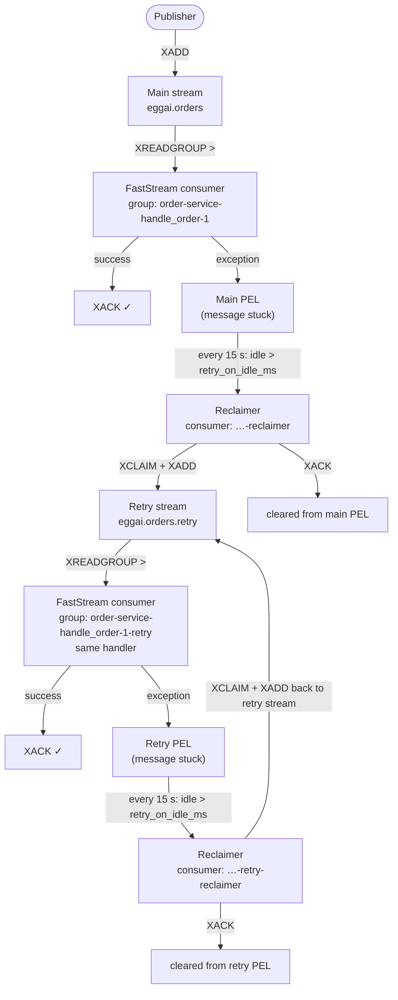

# RedisTransport

Redis Streams transport for EggAI — the recommended choice for most production workloads.

## Why Redis Streams?

Redis Streams provide durable, ordered message delivery with native consumer group support. Compared to the in-memory transport (testing only) and Kafka (very high throughput, higher operational cost), Redis Streams hit a practical sweet spot:

| | In-Memory | **Redis Streams** | Kafka |
|---|---|---|---|
| Persistence | ❌ | ✅ AOF / RDB | ✅ |
| Consumer groups | ❌ | ✅ | ✅ |
| Setup complexity | None | **Simple** | Moderate |
| Throughput | Very high | **100 K+ msg/s** | 1 M+ msg/s |
| Operational cost | None | **Low** | Higher |
| Production ready | ❌ | ✅ **Recommended** | ✅ |

## Installation

Redis support is included in the default `eggai` package — no extra extras needed:

```bash
pip install eggai
```

## Quick Start

```python
import asyncio
from eggai import Agent, Channel
from eggai.transport.redis import RedisTransport

transport = RedisTransport(url="redis://localhost:6379")
agent = Agent(name="my-agent", transport=transport)
orders = Channel("orders", transport=transport)

@agent.subscribe(channel=orders)
async def handle_order(message):
    print("Received:", message)

async def main():
    await agent.start()
    await orders.publish({"type": "order_placed", "order_id": "ORD-1"})
    await asyncio.sleep(1)
    await agent.stop()

asyncio.run(main())
```

## Configuration

```python
transport = RedisTransport(
    url="redis://localhost:6379",   # Redis connection URL
    # All standard redis-py / aioredis options are forwarded:
    # password, ssl, max_connections, socket_timeout, …
)
```

The `url` accepts `redis://`, `rediss://` (TLS), and `unix://` schemes.

## Reliable Message Delivery

### The Problem: Stuck Messages

With the default `NACK_ON_ERROR` ack policy, a handler exception leaves the message in Redis's **Pending Entries List (PEL)**. FastStream reads only new messages (`XREADGROUP … >`), so a failed message stays stuck in the PEL indefinitely — it is never redelivered.

### SDK-Managed Retry with `retry_on_idle_ms`

Enable automatic retry by setting `retry_on_idle_ms` on any subscription:

```python
from eggai import Agent, Channel
from eggai.transport.redis import RedisTransport

transport = RedisTransport(url="redis://localhost:6379")
agent = Agent("order-service", transport=transport)
orders = Channel("orders", transport=transport)

@agent.subscribe(channel=orders, retry_on_idle_ms=30_000)
async def handle_order(message):
    # If this raises, the message stays in the PEL.
    # After 30 s idle the SDK moves it to eggai.orders.retry
    # and this same handler is called again.
    await process_order(message)

asyncio.run(agent.start())
```

The SDK automatically:

1. Starts a background reclaimer that scans the PEL every 15 seconds (configurable via `retry_reclaim_interval_s`).
2. Moves idle messages (older than `retry_on_idle_ms`) to a dedicated `{channel}.retry` stream.
3. Subscribes the **same handler** to the retry stream.
4. Runs a second reclaimer on the retry stream that re-queues back to itself — no `.retry.retry` chain.

### How It Works



### Injected Retry Metadata

Two fields are added to the message on retry delivery to help with deduplication:

| Field | Value |
|---|---|
| `_retry_count` | `"1"`, `"2"`, … — incremented on each reclaim cycle |
| `_original_message_id` | Redis stream ID of the original message |

```python
@agent.subscribe(channel=orders, retry_on_idle_ms=30_000)
async def handle_order(message):
    retry_count = int(message.get("_retry_count", "0"))
    original_id = message.get("_original_message_id")

    if retry_count > 0:
        print(f"Retry #{retry_count} for message {original_id}")

    await process_order(message)
```

### Delivery Guarantee

**At-least-once.** `XADD` and `XACK` are not atomic — a crash between them will re-deliver the message on the next reclaim cycle. Handlers must be **idempotent**. Use `_original_message_id` for application-level deduplication.

### Tuning the Reclaimer

```python
@agent.subscribe(
    channel=orders,
    retry_on_idle_ms=30_000,        # reclaim after 30 s idle (default: None = disabled)
    retry_reclaim_interval_s=15.0,  # scan PEL every 15 s   (default: 15.0)
)
async def handle_order(message):
    ...
```

Guidelines:

- `retry_on_idle_ms` should be comfortably longer than your handler's expected worst-case execution time to avoid false positives.
- `retry_reclaim_interval_s` controls how often the background reclaimer wakes up. Lower values increase Redis load; 15 s is a sensible default for most workloads.

### Constraints

- `min_idle_time` (FastStream's built-in `XAUTOCLAIM`) and `retry_on_idle_ms` are **mutually exclusive** on the same subscription — mixing them raises `ValueError`.
- Binary (non-UTF-8) field values are not supported; use JSON-serialisable payloads.

## Advanced: Manual Claiming with `min_idle_time`

For full control over which consumer group claims pending messages, use FastStream's built-in `XAUTOCLAIM` via `min_idle_time`. This is useful when you want a separate recovery agent to take over messages from a failed consumer:

```python
# Agent 1: processes normally but may fail
agent1 = Agent("primary-agent", transport=RedisTransport())
channel = Channel("jobs", transport=agent1._transport)

@agent1.subscribe(channel=channel)
async def primary_handler(message):
    ...  # may raise

# Agent 2: claims messages idle for > 5 s from the same group
group_name = "primary-agent-primary_handler-1"
agent2 = Agent("recovery-agent", transport=RedisTransport())
channel2 = Channel("jobs", transport=agent2._transport)

@agent2.subscribe(channel=channel2, group=group_name, min_idle_time=5_000)
async def recovery_handler(message):
    ...  # guaranteed to succeed
```

!!! warning
    `min_idle_time` and `retry_on_idle_ms` are mutually exclusive on the same subscription.

## Backward Compatibility

`retry_on_idle_ms` is fully opt-in. Existing subscriptions without it behave exactly as before — no extra streams, no background tasks, no changed semantics.

## API Reference

::: eggai.transport.RedisTransport
