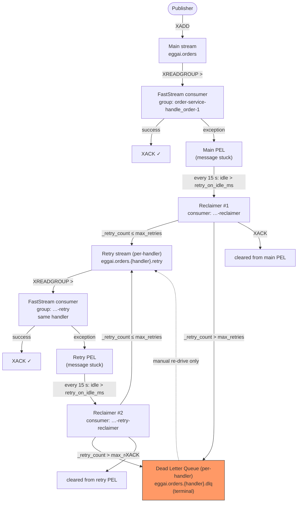

# RedisTransport

Redis Streams transport for EggAI — the recommended choice for most production workloads.

## Why Redis Streams?

Redis Streams provide durable, ordered message delivery with native consumer group support. Compared to the in-memory transport (testing only) and Kafka (very high throughput, higher operational cost), Redis Streams hit a practical sweet spot:

| | In-Memory | **Redis Streams** | Kafka |
|---|---|---|---|
| Persistence | ❌ | ✅ AOF / RDB | ✅ |
| Consumer groups | ❌ | ✅ | ✅ |
| Setup complexity | None | **Simple** | Moderate |
| Throughput | Very high | **100 K+ msg/s** | 1 M+ msg/s |
| Operational cost | None | **Low** | Higher |
| Production ready | ❌ | ✅ **Recommended** | ✅ |

## Installation

Redis support is included in the default `eggai` package — no extra extras needed:

```bash
pip install eggai
```

## Quick Start

```python
import asyncio
from eggai import Agent, Channel
from eggai.transport.redis import RedisTransport

transport = RedisTransport(url="redis://localhost:6379")
agent = Agent(name="my-agent", transport=transport)
orders = Channel("orders", transport=transport)

@agent.subscribe(channel=orders)
async def handle_order(message):
    print("Received:", message)

async def main():
    await agent.start()
    await orders.publish({"type": "order_placed", "order_id": "ORD-1"})
    await asyncio.sleep(1)
    await agent.stop()

asyncio.run(main())
```

## Configuration

```python
transport = RedisTransport(
    url="redis://localhost:6379",   # Redis connection URL
    # All standard redis-py / aioredis options are forwarded:
    # password, ssl, max_connections, socket_timeout, …
)
```

The `url` accepts `redis://`, `rediss://` (TLS), and `unix://` schemes.

### Consuming an Existing Backlog

A consumer group is created at `$` by default: it only sees entries published
after it exists. To let a new consumer pick up the entries already in the
stream, pass `group_start="0"` (or an explicit stream id):

```python
@agent.subscribe(channel=orders, group_start="0")
async def handle_order(message):
    ...
```

`group_start` only applies when the group does not exist yet. A group remembers
its position across restarts, so this does not replay the stream every time the
service starts. `last_id` is for group-less subscriptions only and is rejected
together with a consumer group.

## Reliable Message Delivery

### The Problem: Stuck Messages

With the default `NACK_ON_ERROR` ack policy, a handler exception leaves the message in Redis's **Pending Entries List (PEL)**. FastStream reads only new messages (`XREADGROUP … >`), so a failed message stays stuck in the PEL indefinitely — it is never redelivered.

### SDK-Managed Retry with `retry_on_idle_ms`

Enable automatic retry by setting `retry_on_idle_ms` on any subscription:

```python
from eggai import Agent, Channel
from eggai.transport.redis import RedisTransport

transport = RedisTransport(url="redis://localhost:6379")
agent = Agent("order-service", transport=transport)
orders = Channel("orders", transport=transport)

@agent.subscribe(channel=orders, retry_on_idle_ms=30_000)
async def handle_order(message):
    # If this raises, the message stays in the PEL.
    # After 30 s idle the SDK moves it to a per-handler retry stream
    # (e.g. eggai.orders.order-service-handle_order-1.retry) and this
    # same handler is called again.
    await process_order(message)

asyncio.run(agent.start())
```

The SDK automatically:

1. Starts a background reclaimer that scans the PEL every 15 seconds (configurable via `retry_reclaim_interval_s`).
2. Moves idle messages (older than `retry_on_idle_ms`) to a dedicated **per-handler** `{channel}.{handler_suffix}.retry` stream. The per-handler suffix avoids one handler's failures being broadcast to other handlers on the same channel.
3. Subscribes the **same handler** to the retry stream.
4. Runs a second reclaimer on the retry stream that re-queues back to itself — no `.retry.retry` chain.
5. After `max_retries` retry attempts (default 5), routes the message to a `{channel}.{handler_suffix}.dlq` Dead Letter Queue instead of retrying again.

### How It Works

Three Redis streams are involved. The `eggai.` prefix is the default `EGGAI_NAMESPACE`, not a fixed prefix: with `EGGAI_NAMESPACE=prod` the keys become `prod.orders`, `prod.orders.<handler>.retry` and `prod.orders.<handler>.dlq`.

| Stream | Purpose |
|---|---|
| `eggai.orders` | Main stream — where messages arrive normally |
| `eggai.orders.order-service-handle_order-1.retry` | Retry stream — where failed messages get another chance (per-handler; suffix is the handler id) |
| `eggai.orders.order-service-handle_order-1.dlq` | Dead Letter Queue — terminal; poison messages land here (per-handler) |


```mermaid
flowchart TD
    PUB([Publisher]) -->|XADD| MS["Main stream\neggai.orders"]

    MS -->|XREADGROUP &gt;| FC["FastStream consumer\ngroup: order-service-handle_order-1"]
    FC -->|success| ACK1[XACK ✓]
    FC -->|exception| PEL1["Main PEL\n(message stuck)"]

    PEL1 -->|"every 15 s: idle &gt; retry_on_idle_ms"| RC1["Reclaimer #1\nconsumer: …-reclaimer"]
    RC1 -->|"_retry_count ≤ max_retries"| RS["Retry stream (per-handler)\neggai.orders.{handler}.retry"]
    RC1 -->|"_retry_count &gt; max_retries"| DLQ["Dead Letter Queue (per-handler)\neggai.orders.{handler}.dlq\n(terminal)"]
    RC1 -->|XACK| DONE1[cleared from main PEL]

    RS -->|XREADGROUP &gt;| FC2["FastStream consumer\ngroup: …-retry\nsame handler"]
    FC2 -->|success| ACK2[XACK ✓]
    FC2 -->|exception| PEL2["Retry PEL\n(message stuck)"]

    PEL2 -->|"every 15 s: idle &gt; retry_on_idle_ms"| RC2["Reclaimer #2\nconsumer: …-retry-reclaimer"]
    RC2 -->|"_retry_count ≤ max_retries"| RS
    RC2 -->|"_retry_count &gt; max_retries"| DLQ
    RC2 -->|XACK| DONE2[cleared from retry PEL]

    DLQ -.->|manual re-drive only| RS

    style DLQ fill:#f96,stroke:#333
```

With `max_retries=5` (the default), a message gets up to **6 total handler calls** (1 original + 5 retries). On the 6th reclaim cycle, it is routed to the DLQ instead of the retry stream.

### Injected Retry Metadata

Two fields are added to the message on retry delivery to help with deduplication:

| Field | Value |
|---|---|
| `_retry_count` | `"1"`, `"2"`, … — incremented on each reclaim cycle |
| `_original_message_id` | Redis stream ID of the original message |

```python
@agent.subscribe(channel=orders, retry_on_idle_ms=30_000)
async def handle_order(message):
    retry_count = int(message.get("_retry_count", "0"))
    original_id = message.get("_original_message_id")

    if retry_count > 0:
        print(f"Retry #{retry_count} for message {original_id}")

    await process_order(message)
```

### Delivery Guarantee

**At-least-once.** `XADD` and `XACK` are not atomic — a crash between them will re-deliver the message on the next reclaim cycle. Handlers must be **idempotent**. Use `_original_message_id` for application-level deduplication.

### Dead Letter Queue (DLQ)

By default, messages that fail more than `max_retries` times (default 5) are routed to a `{channel}.{handler_suffix}.dlq` stream (per-handler). The DLQ is **terminal** — no automatic reclaimer watches it. Messages sit there until manually re-driven.

```python
@agent.subscribe(
    channel=orders,
    retry_on_idle_ms=30_000,
    max_retries=3,  # 3 retries → 4 total handler calls, then DLQ
)
async def handle_order(message):
    await process_order(message)
```

To disable the DLQ and get unlimited retries (previous behavior):

```python
@agent.subscribe(
    channel=orders,
    retry_on_idle_ms=30_000,
    max_retries=None,  # no DLQ, retries forever
)
async def handle_order(message):
    ...
```

#### `on_dlq` Callback

You can provide a callback that fires whenever a message is sent to the DLQ — useful for alerting or metrics:

```python
async def alert_on_dlq(fields, msg_id, retry_count):
    print(f"Message {msg_id} sent to DLQ after {retry_count} retries")

@agent.subscribe(
    channel=orders,
    retry_on_idle_ms=30_000,
    max_retries=5,
    on_dlq=alert_on_dlq,
)
async def handle_order(message):
    ...
```

The callback can be sync or async. Errors in the callback are logged but never prevent the DLQ write.

!!! note "At-least-once applies to DLQ writes too"
    The `XADD` (to DLQ) and `XACK` are not atomic. A crash between them can produce duplicate DLQ entries — and fire `on_dlq` more than once — for the same logical message. Re-drive tooling and `on_dlq` callbacks should deduplicate using `_original_message_id`.

#### Shared DLQ channel (`dlq_channel`)

A DLQ stream is a plain Redis stream with the same envelope as any channel, so an eggai subscriber can consume it. What makes that awkward by default is the naming: one key per handler, derived from the agent name, the function name and a counter. Rename a handler and a listener silently watches an empty stream.

`dlq_channel` replaces the per-handler key with one you choose, so every handler — across services, if they share the value — dead-letters into a single stream that one consumer can subscribe to:

```python
dlq = Channel("dlq", transport=transport)

@agent.subscribe(channel=orders, retry_on_idle_ms=30_000, max_retries=3, dlq_channel=dlq)
async def handle_order(message): ...

@agent.subscribe(channel=payments, retry_on_idle_ms=30_000, max_retries=3, dlq_channel="dlq")
async def handle_payment(message): ...
```

`dlq_channel` accepts a `Channel` or a topic name; a name is namespaced exactly like `Channel(name)`, so `"dlq"` becomes `<EGGAI_NAMESPACE>.dlq`. Only the terminal sink is shared — each handler keeps its own `.retry` stream (sharing it would re-introduce the cross-handler fan-out fixed in #225).

The consumer is an ordinary subscription. Two things to get right:

```python
@ops_agent.subscribe(
    channel=dlq,
    group_start="0",   # new group starts at the beginning: failures that happened
)                      # before this service booted are picked up, not skipped
async def on_dead_letter(message):
    # No data_type here: the shared stream carries every payload type.
    # Dispatch on message["type"] or on the provenance below.
    source  = message["_dlq_source"]     # e.g. "eggai.orders"
    handler = message["_dlq_handler"]    # e.g. "order-service-handle_order-1"
    ...
```

Do **not** give the sink `retry_on_idle_ms` together with the same `dlq_channel`: a handler dead-lettering into its own input is a loop, and `subscribe()` rejects it. If the sink needs retries, let it default to its own per-handler DLQ.

**Provenance on every DLQ entry.** Because a shared stream's key no longer says where an entry came from, the reclaimer stamps it into the JSON body (body, not extra `XADD` fields: FastStream's decoder reads only `__data__`, so body keys are all a subscriber sees). This applies to per-handler DLQs too.

| Field | Value |
|-------|-------|
| `_dlq_source` | full key of the channel the handler subscribed to |
| `_dlq_handler` | handler suffix / consumer group |
| `_dlq_at` | ISO-8601 UTC timestamp of the DLQ write |
| `_dlq_reason` | `"max_retries"`, or `"poison"` for an unparseable envelope |
| `_dlq_retries` | how many retries actually ran before giving up (`max_retries`; `"0"` for poison) |
| `_retry_count` | **reset to `"0"`** on the DLQ write |
| `_original_message_id` | as on retry delivery |

Two rules make a DLQ entry safe to *consume*, not just inspect. `_retry_count` is reset so a DLQ consumer that has its own `retry_on_idle_ms` starts with a fresh budget — otherwise it would inherit an already-exceeded count, be dead-lettered again on its first transient failure and, with backoff, wait `base × multiplier^exhausted` for its first reclaim. And the `_dlq_*` keys are written set-if-absent, so when that consumer does give up and dead-letters the entry into its own DLQ, the original origin is preserved rather than overwritten with the consumer's own channel and handler.

**No `MAXLEN` on a shared DLQ.** `retry_max_len` caps the retry streams and per-handler DLQs, not a shared `dlq_channel`. `XADD MAXLEN` trims the whole stream regardless of which writer appended, so with several services writing to one DLQ the smallest cap among them would silently delete the others' unconsumed dead letters. A shared DLQ is written untrimmed; retention is the sink's responsibility (`XTRIM`, or a scheduled trim once entries are processed).

**Poison entries are wrapped.** An envelope the reclaimer cannot parse used to be copied to the DLQ verbatim; FastStream's parser then falls back to raw bytes, which a typed subscription silently skips and an untyped one cannot use. It is now written as a fresh envelope whose body holds the fields above plus the original bytes as `_dlq_raw_b64`, so every DLQ entry decodes to a JSON object. Re-drive tooling that handled raw poison entries should read `_dlq_raw_b64` instead.

Validation: `dlq_channel` requires `retry_on_idle_ms` and a non-`None` `max_retries` (with `max_retries=None` there is no DLQ to redirect), must differ from the subscribed channel, and must not end in `.retry` (every `.retry` stream is auto-consumed by some handler, so dead-lettering into one would feed that handler's retry loop). All of it fails at `subscribe()` time, before anything is registered on the broker.

### Tuning the Reclaimer

```python
@agent.subscribe(
    channel=orders,
    retry_on_idle_ms=30_000,        # reclaim after 30 s idle (default: None = disabled)
    retry_reclaim_interval_s=15.0,  # scan PEL every 15 s   (default: 15.0)
    max_retries=5,                  # route to DLQ after 5 retries (default: 5)
)
async def handle_order(message):
    ...
```

Guidelines:

- `retry_on_idle_ms` should be comfortably longer than your handler's expected worst-case execution time to avoid false positives.
- `retry_reclaim_interval_s` controls how often the background reclaimer wakes up. Lower values increase Redis load; 15 s is a sensible default for most workloads.
- `max_retries` prevents poison messages from looping forever. Set to `None` for unlimited retries (no DLQ).

### Automatic Recovery from Redis Stream Loss (NOGROUP)

If Redis loses streams mid-life — due to a restart without persistence, a failover, or memory eviction — FastStream's consume loop retries `XREADGROUP` but never re-runs `XGROUP CREATE`, resulting in an infinite `NOGROUP` error loop.

The SDK handles this automatically with two mechanisms:

1. **Background stream group monitor** — `RedisTransport` runs a lightweight background task that periodically calls `XGROUP CREATE` with `MKSTREAM` for every registered subscription. When groups already exist the call is a no-op (`BUSYGROUP`), so overhead under normal operation is negligible.

2. **NOGROUP-aware reclaimer** — `PendingReclaimerManager` catches `NOGROUP` errors during reclaim cycles and recreates the consumer group instead of logging an unhandled exception every cycle.

No configuration is needed — both mechanisms are always active when using `RedisTransport`.

### Constraints

- `min_idle_time` (FastStream's built-in `XAUTOCLAIM`) and `retry_on_idle_ms` are **mutually exclusive** on the same subscription — mixing them raises `ValueError`.
- Binary (non-UTF-8) field values are not supported; use JSON-serialisable payloads.

## Advanced: Manual Claiming with `min_idle_time`

For full control over which consumer group claims pending messages, use FastStream's built-in `XAUTOCLAIM` via `min_idle_time`. This is useful when you want a separate recovery agent to take over messages from a failed consumer:

```python
# Agent 1: processes normally but may fail
agent1 = Agent("primary-agent", transport=RedisTransport())
channel = Channel("jobs", transport=agent1._transport)

@agent1.subscribe(channel=channel)
async def primary_handler(message):
    ...  # may raise

# Agent 2: claims messages idle for > 5 s from the same group
group_name = "primary-agent-primary_handler-1"
agent2 = Agent("recovery-agent", transport=RedisTransport())
channel2 = Channel("jobs", transport=agent2._transport)

@agent2.subscribe(channel=channel2, group=group_name, min_idle_time=5_000)
async def recovery_handler(message):
    ...  # guaranteed to succeed
```

!!! warning
    `min_idle_time` and `retry_on_idle_ms` are mutually exclusive on the same subscription.

## Backward Compatibility

`retry_on_idle_ms` is fully opt-in. Existing subscriptions without it behave exactly as before — no extra streams, no background tasks, no changed semantics.

## API Reference

::: eggai.transport.RedisTransport
