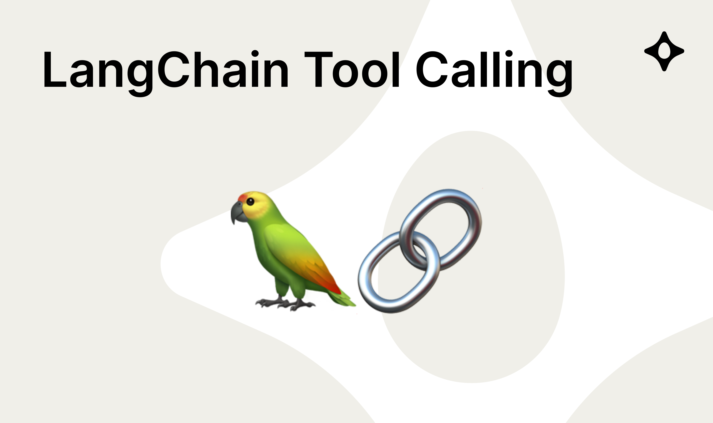
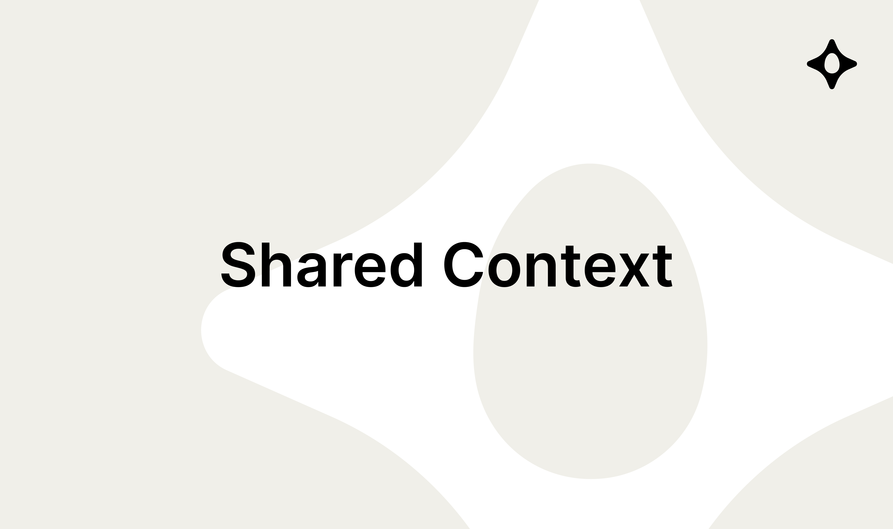



## Examples

We encourage you to **copy/paste** from our [examples folder](examples), which includes:

<table>
  <tbody>
    <tr>
      <td>
        <a href="examples/00-getting-started"><strong>Getting Started</strong></a>: 
        Orchestrate two agents asynchronously.
      </td>
      <td>
        
      </td>
    </tr>
    <tr>
      <td>
        <a href="examples/01-coordinator"><strong>Coordinator</strong></a>: 
        Bridge multiple communication channels.
      </td>
      <td>
        
      </td>
    </tr>
    <tr>
      <td>
        <a href="examples/02-websocket-gateway"><strong>Websocket Gateway</strong></a>: 
        Real-time interaction via WebSockets.
      </td>
      <td>
        
      </td>
    </tr>
    <tr>
      <td>
        <a href="examples/03-langchain-tool-calling"><strong>LangChain Tool Calling</strong></a>: 
        Integrate tool calling with LangChain.
      </td>
      <td>
        
      </td>
    </tr>
    <tr>
      <td>
        <a href="examples/04-context"><strong>Shared Context</strong></a>: 
        Maintain shared context across agents.
      </td>
      <td>
        
      </td>
    </tr>
    <tr>
      <td>
        <a href="examples/05-litellm-agent"><strong>LiteLLM Integration</strong></a>: 
        Power agents with LiteLLM.
      </td>
      <td>
        
      </td>
    </tr>
    <tr>
      <td>
        <a href="examples/06-multi-agent-conversation"><strong>Multi-Agent Conversation</strong></a>: 
        Context aware multi-agent conversations.
      </td>
      <td>
        
      </td>
    </tr>
  </tbody>
</table>

### Why Copy/Paste?

**1. Full Ownership and Control**  
By copying and pasting, you have direct access to the underlying implementation. Tweak or rewrite as you see fit, the code is truly yours.

**2. Separation of Concerns**  
Just like decoupling design from implementation, copying code (rather than installing a monolithic dependency) reduces friction if you want to restyle or refactor how agents are structured.

**3. Flexibility**  
Not everyone wants a one-size-fits-all library. With copy/paste “recipes,” you can integrate only the parts you need.

**4. No Hidden Coupling**  
Sometimes, prepackaged frameworks lock in design decisions. By copying from examples, you choose exactly what gets included and how it’s used.
