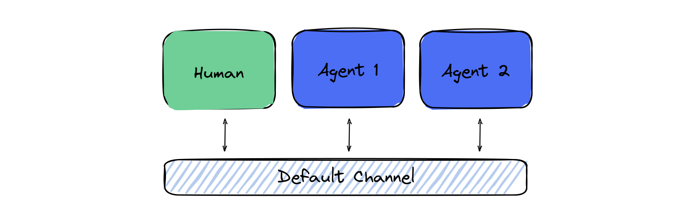

# Getting Started with EggAI Multi-Agent Meta Framework 🤖

Welcome to the **EggAI Multi-Agent Meta Framework**! This guide will help you set up and run a simple use case demonstrating how to orchestrate and manage two agents in an asynchronous, event-driven architecture. Let's dive in! 🚀

The code for the example can be found [here](https://github.com/eggai-tech/EggAI/tree/main/examples/00-getting-started)

---

## Prerequisites 🔧

Before you begin, ensure you have the following tools installed:

- **Python** 3.10+
- **Docker** and **Docker Compose**

---

## Overview 🔄

The example demonstrates two agents communicating and collaborating within the EggAI framework. Below is a simplified UML chart of the architecture for this example:



### Key Features Highlighted:

- 🕴️ **Agent Collaboration:** Two agents working together in an event-driven environment.
- 🛠️ **Asynchronous Execution:** Agents are designed to process tasks concurrently, ensuring efficiency.
- 🛰 **Scalable Infrastructure:** Powered by Kafka for reliable messaging and streaming.

---

## Setup Instructions ⏳

### Step 1: Create a Virtual Environment (Optional but Recommended) 🌍

To avoid dependency conflicts, create and activate a virtual environment:

```bash
python -m venv venv
source venv/bin/activate  # For Windows: venv\Scripts\activate
```

---

### Step 2: Install the EggAI Library 🎓

Use `pip` to install the EggAI framework:

```bash
pip install eggai
```

---

### Step 3: Start Required Services with Docker 🚢

EggAI relies on brokers like Kafka or [Redpanda](https://github.com/redpanda-data/redpanda) and other services to function seamlessly. Start these services using Docker Compose:

```bash
docker compose up -d
```

This command will:
- Spin up the [Redpanda](https://github.com/redpanda-data/redpanda) broker.
- Start the necessary infrastructure components for the framework.

---

## Running the Example 🏆

The example code for handling two agents is included in the `examples/` folder. Run the `main.py` file to execute the demo:

```bash
python main.py
```

What happens:
- Agent 1 sends a message to Agent 2.
- Agent 2 processes the message and sends a response.
- The framework handles message passing, retries, and logging.

Congratulations! You've successfully run your first EggAI Multi-Agent application. 🎉

---

## Stopping and Cleaning Up ❌

When you're done, stop and clean up the Docker containers to free up resources:

```bash
docker compose down -v
```

This will stop all running containers and remove any associated volumes.

---

## Next Steps 🚀

Ready to explore further? Check out:
- **Advanced Examples:** Discover more complex use cases in the `examples/` folder.
- **Contribution Guidelines:** Get involved and help improve EggAI!
- **GitHub Issues:** [Submit a bug or feature request](https://github.com/eggai-tech/eggai/issues).
- **Documentation:** Refer to the official docs for deeper insights.

Thank you for choosing EggAI Multi-Agent Meta Framework. Happy coding! 🤖🥚

