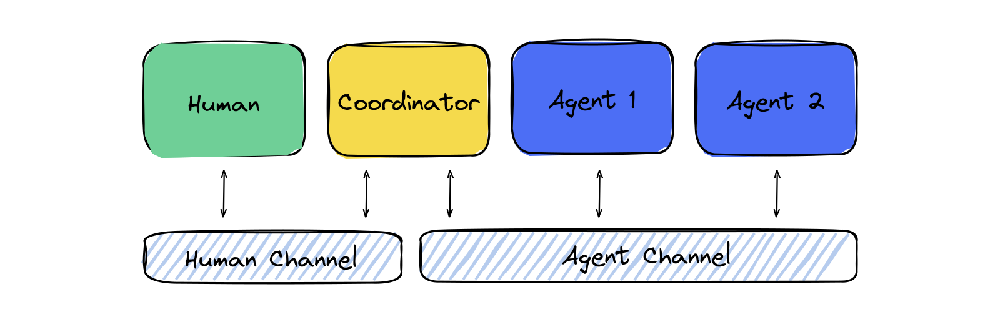

# Advanced Use Case: Multi-Agent Communication with Human and Agent Channels 🤖

Welcome to the advanced example of the **EggAI Multi-Agent Framework**! This demo highlights a more complex workflow involving **two communication channels**:

1. **Human Channel**: Exposes an interface for users (or frontends) to send and receive data related to complex workflows managed by agents.
2. **Agent Channel**: Handles message passing and events between multiple agents.

In this setup, a **Coordinator Agent** orchestrates the flow between the human channel and the worker agents: **Email Agent** and **Order Agent**.

The code for the example can be found [here](https://github.com/eggai-tech/EggAI/tree/main/examples/01-coordinator)

Let’s get started! 🚀

---

## Prerequisites 🔧

Before you begin, ensure you have the following tools installed:

- **Python** 3.10+
- **Docker** and **Docker Compose**

---

## Overview 🔄

In this demo, you will:

- Use a **Human Channel** to send a request to create an order.
- Have the **Coordinator Agent** process the request and distribute tasks to the worker agents.
- Receive a notification via the **Human Channel** once the task is completed.

Below is the architecture diagram for this example:



### Key Features Highlighted:

- 🤝 **Human-Agent Interaction:** Human Channel bridges the gap between users and agents.
- 🧑‍🤝‍🧑 **Coordinator Role:** Coordinator Agent orchestrates workflows and delegates tasks to worker agents.
- 📬 **Worker Agents:** Specialized agents handle specific tasks, like email notifications and order processing.
- ⚡ **Event-Driven Design:** Real-time updates and notifications via the Human Channel.

---

## Setup Instructions ⏳

### Step 1: Create a Virtual Environment (Optional but Recommended) 🌍

To avoid dependency conflicts, create and activate a virtual environment:

```bash
python -m venv venv
source venv/bin/activate  # For Windows: venv\Scripts\activate
```

---

### Step 2: Install the EggAI Library 🎓

Use `pip` to install the EggAI framework:

```bash
pip install eggai
```

---

### Step 3: Start Required Services with Docker 🚢

EggAI relies on brokers like Kafka or [Redpanda](https://github.com/redpanda-data/redpanda) and other services to function seamlessly. Start these services using Docker Compose:

```bash
docker compose up -d
```

This command will:
- Spin up the [Redpanda](https://github.com/redpanda-data/redpanda) broker.
- Start the necessary infrastructure components for the framework.

---

## Running the Example 🏆

The example code for this demo is included in the `examples/01-coordinator/main.py` folder. Run the `main.py` file to execute the workflow:

```bash
python main.py
```

### Workflow Description:

1. **Request Sent to Human Channel**:
   - The `main.py` file sends a request to create an order (`Laptop`, quantity `1`) via the Human Channel.

2. **Coordinator Orchestrates Workflow**:
   - The Coordinator Agent receives the request and delegates tasks to the worker agents:
     - **Order Agent**: Processes the order creation.
     - **Email Agent**: Sends an email notification for the created order.

3. **Notification Sent Back to Human Channel**:
   - Once the workflow is complete, the Coordinator publishes an update to the Human Channel, notifying the user that the task has been successfully processed.

### Example Output:

```plaintext
[COORDINATOR]: action message received. Forwarding to agents channel.
Agent is running. Press Ctrl+C to stop.
[ORDER AGENT]: order_requested event received. Emitting order_created event.
[EMAIL AGENT]: order_created event received. Sending email to customer.
[EMAIL AGENT]: order_created event received. Sending notification event.
[ORDER AGENT]: order_created event received.
[COORDINATOR]: human=true message received. Forwarding to human channel.
[COORDINATOR]: Received notification for human:  Order created, you will receive an email soon.
```

---

## Stopping and Cleaning Up ❌

When you're done, stop and clean up the Docker containers to free up resources:

```bash
docker compose down -v
```

This will stop all running containers and remove any associated volumes.

---

## Next Steps 🚀

Ready to explore further? Check out:
- **Advanced Examples:** Discover more complex use cases in the `examples/` folder.
- **Contribution Guidelines:** Get involved and help improve EggAI!
- **GitHub Issues:** [Submit a bug or feature request](https://github.com/eggai-tech/eggai/issues).
- **Documentation:** Refer to the official docs for deeper insights.

Thank you for choosing EggAI Multi-Agent Framework. Happy coding! 🤖🥚