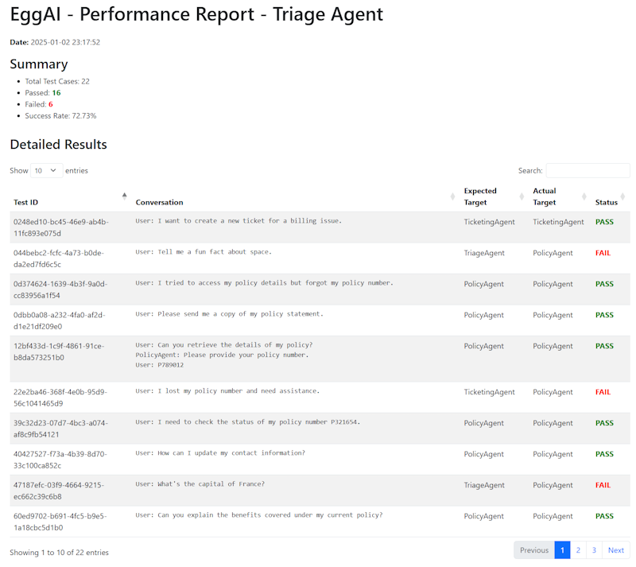

# Agent Evaluation and Enhancement Example for EggAI 🥚🤖

## **A Story of Refinement and Improvement**

In the quest to build intelligent and responsive multi-agent systems, continuous evaluation and enhancement of each agent's performance are paramount. The **Agent Evaluation and Enhancement** example for **EggAI** embodies this journey. Focused on refining the **TriageAgent**, this example demonstrates how to assess agent effectiveness, identify areas for improvement, and generate actionable insights through automated testing and reporting.

---

## **Building on Proven Foundations**

To create a robust evaluation framework, we integrated key components from previous EggAI examples:

- **WebSocket Gateway (`examples/02-websocket-gateway`)**:
  - **Purpose**: Facilitates real-time communication between agents and users.
  - **Integration**: Provides the communication backbone for sending and receiving test messages during evaluation.

- **LiteLlmAgent (`examples/05-litellm-agent`)**:
  - **Purpose**: Enables efficient interaction with language models.
  - **Integration**: Powers the **TriageAgent**, allowing it to process and respond to user messages accurately.

- **Triage Concept (`examples/06-multi-agent-conversation`)**:
  - **Purpose**: Implements intelligent routing of user messages to appropriate agents.
  - **Integration**: Serves as the foundation for enhancing the **TriageAgent**'s decision-making capabilities.

---

## **What’s Inside?** 🗂️

### **Agent Evaluation Framework**

- **Test Code (`tests/test_triage_agent.py`)**:
  - **Functionality**: Automates the testing of the **TriageAgent** against a predefined JSON dataset.
  - **Features**:
    - Parses user-agent conversations.
    - Mocks message publishing to simulate agent responses.
    - Validates the **TriageAgent**'s ability to correctly route messages.
    - Records success and failure outcomes.

- **Dataset (`datasets/triage-training.json`)**:
  - **Content**: A collection of conversation samples with expected routing targets.
  - **Purpose**: Serves as the benchmark for evaluating the **TriageAgent**'s performance.

- **Reporting Tools**:
  - **JSON Results**: Logs detailed test outcomes for further analysis.
  - **HTML Report**: Generates a user-friendly report highlighting test successes and failures, enabling users to identify and address weaknesses in the **TriageAgent**.

---

## **How It Works** 🛠️

1. **Setup**:
   - Ensure all dependencies are installed and services are running.
   
2. **Running Tests**:
   - Execute the test script to evaluate the **TriageAgent** against the conversation dataset.
   
3. **Analyzing Results**:
   - Review the console output for immediate feedback on each test case.
   - Examine the generated HTML report for a comprehensive overview of the agent's performance, including areas that need enhancement.
   
4. **Enhancing the Agent**:
   - Use the insights from the report to refine the **TriageAgent**'s logic, improve keyword detection, and optimize routing guidelines.

---

## **Prerequisites** 🔧

Before diving into the evaluation, ensure you have the following set up:

### **Step 1: Install Dependencies**

```bash
pip install eggai litellm fastapi uvicorn pytest jinja2 python-dotenv
```

### **Step 2: Start Services with Docker**

This example utilizes a messaging broker. Launch the necessary services using Docker:

```bash
docker compose up -d
```

---

## **Running the Evaluation** 🏆

1. **Navigate to the Project Directory**:

   ```bash
   cd path/to/project-directory
   ```

2. **Execute the Test Script**:

   ```bash
   pytest tests/test_triage_agent.py
   ```

   - **Outcome**: The script will run through each conversation in the dataset, evaluate the **TriageAgent**'s routing decisions, and output the results.

3. **Access the HTML Report**:

   After the tests complete, an HTML report will be generated in the `reports` directory. Open the report in your web browser to review detailed results.

   ```bash
   open reports/YYYYMMDD-HHMMSS-triage-agent-report.html
   ```

---

## **Expected Output** 📤

Upon running the tests, you will observe:

- **Console Output**:
  - A log of each test case indicating **PASS** or **FAIL**, along with pertinent details.
  - A summary showing the total number of tests, successes, failures, and the overall success rate.

- **HTML Report**:
  - A visually appealing and interactive report detailing each test case.
  - Sections highlighting the summary of results and detailed insights into each conversation's outcome.
  - Indicators for successful and failed tests to quickly identify areas needing attention.



---

## **Architecture Overview** 🔁

1. **Test Execution**:
   - The test script sends predefined conversations to the **TriageAgent** via the WebSocket gateway.
   
2. **TriageAgent Processing**:
   - Analyzes each conversation to determine the appropriate target agent based on the content and context.
   
3. **Result Collection**:
   - The test script captures the **TriageAgent**'s routing decisions and compares them against expected outcomes.
   
4. **Reporting**:
   - Successes and failures are logged and compiled into a comprehensive HTML report for review and further enhancement.

---

## **Code Breakdown** 🔬

### **Key Components**

1. **Test Script (`tests/test_triage_agent.py`)**:
   - **Functions**:
     - `parse_conversation`: Converts conversation text into structured message formats.
     - `test_handle_user_message`: Runs the evaluation by sending conversations to the **TriageAgent** and recording outcomes.
     - `generate_html_report`: Creates an HTML report using Jinja2 templates to visualize test results.

2. **Dataset (`datasets/triage-training.json`)**:
   - Contains a variety of conversation scenarios to rigorously test the **TriageAgent**'s routing logic.

3. **Reporting Mechanism**:
   - Utilizes Jinja2 for templating and Bootstrap for styling to produce an intuitive and informative HTML report.

4. **Agent Integration**:
   - **TriageAgent** leverages the **LiteLlmAgent** for processing and decision-making, ensuring accurate and efficient message routing.

---

## **Cleaning Up** ❌

After completing your evaluations, gracefully shut down the services to free up resources:

```bash
docker compose down -v
```

- **Effect**: Stops and removes the Docker containers along with their associated volumes, ensuring no residual processes remain active.

---

## **Next Steps** 🚀

Elevate your agent evaluation and enhancement process with these actionable steps:

- **Refine the Dataset**: Expand the `triage-training.json` with more diverse conversation scenarios to further test the **TriageAgent**'s capabilities.
  
- **Enhance Reporting**: Customize the HTML report to include additional metrics, visualizations, or interactive elements for deeper insights.
  
- **Automate Enhancements**: Integrate the evaluation framework into a CI/CD pipeline to continuously assess and improve agent performance.
  
- **Expand Agent Capabilities**: Use the insights from evaluations to introduce new features or adjust existing ones, ensuring the **TriageAgent** adapts to evolving user needs.
  
- **Learn More**: Explore other EggAI examples to discover advanced testing methodologies and agent integration techniques.
  
- **Contribute**: Share your enhancements, report issues, or contribute new features to the EggAI project to support the community.

---

Thank you for embarking on the **Agent Evaluation and Enhancement** journey with EggAI! 🥚🤖 We hope this example empowers you to build more effective and intelligent agents, driving superior user interactions and system performance. 🙏✨