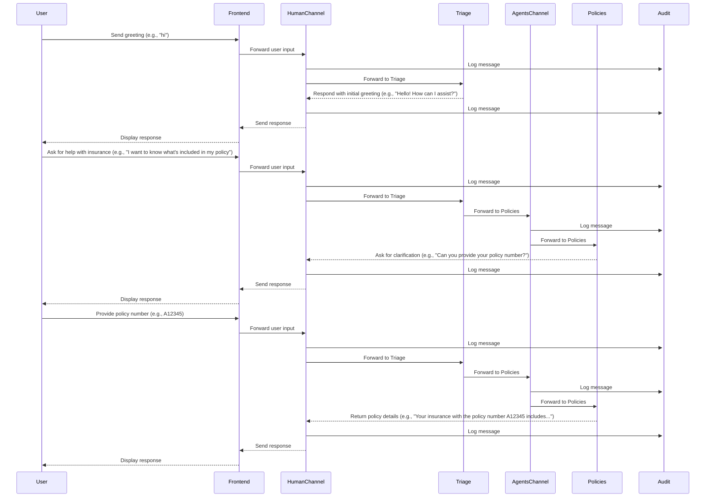

# Multi-Agent Insurance Support System

[](https://sonarcloud.io/summary/new_code?id=eggai-tech_EggAI)

AI agents collaborate in a multi-agent system to provide effective and personalized insurance support.

The code for the example can be found [here](https://github.com/eggai-tech/EggAI/tree/main/examples/multi_agent_human_chat).

> **Note:** This example runs completely locally on your machine, including the language models via LM Studio. No cloud services or API keys are required to run the basic demo.

## User Interaction

Users interact with the system through a WebSocket-enabled chat interface.


## Quick Start

### Prerequisites

- **Python** 3.11+
- **Docker** and **Docker Compose**
- **LM Studio** (for local models) or OpenAI API key (for cloud models)

### 1. Setup

```bash
# Clone the repository
git clone git@github.com:eggai-tech/EggAI.git
cd examples/multi_agent_human_chat

# Create virtual environment and install dependencies
make setup
source .venv/bin/activate  # On Windows: .venv\Scripts\activate

# Copy environment configuration
cp .env.example .env

# (Optional) Configure Guardrails for content moderation
# guardrails configure --token $GUARDRAILS_TOKEN
# guardrails hub install hub://guardrails/toxic_language
```

### 2. Configure Language Models

#### Option A: Local Models (Default - No API Keys Required)
1. Download and install [LM Studio](https://lmstudio.ai/)
2. Launch LM Studio and load a compatible model (e.g., gemma-3-12b-it-qat)
3. Start the local server (should run on http://localhost:1234)

#### Option B: OpenAI Models
Edit `.env` and uncomment the OpenAI model lines:
```bash
# Uncomment these lines in .env
# TRIAGE_LANGUAGE_MODEL=openai/gpt-4o-mini
# OPENAI_API_KEY=your-api-key-here
```

### 3. Start Infrastructure

```bash
make docker-up
```

This starts:
- **Redpanda** - Kafka-compatible messaging
- **Redpanda Console** - Web UI for topics and messages (http://localhost:8082)
- **Grafana** - Monitoring dashboards (http://localhost:3000)
- **MLflow** - Experiment tracking (http://localhost:5001)
- **MinIO** - S3-compatible object storage (http://localhost:9001)
- **PostgreSQL** - Databases for MLflow and Temporal
- **Temporal** - Workflow orchestration for document ingestion
- **Temporal UI** - Workflow monitoring (http://localhost:8081)
- **Vespa** - Vector search engine for Policies agent (http://localhost:19071)
- **OTEL Collector** - OpenTelemetry metrics and traces collection
- **Tempo** - Distributed tracing backend
- **Prometheus** - Metrics storage and querying

### 4. Run the System

```bash
make start-all
```

Open http://localhost:8000 to start chatting!

> **Note**: The first time you run the system, Vespa will take a few minutes to initialize and the Policies agent will ingest documents via Temporal workflows. You can monitor the progress at:
> - Vespa status: http://localhost:19071
> - Temporal workflows: http://localhost:8081

Example queries:
- "What's my premium for policy B67890?"
- "I want to file a claim"
- "What does my home insurance cover?"
- "I have a complaint about my service"

## Architecture


The system consists of specialized agents that collaborate:
- **Frontend** - WebSocket gateway
- **Triage** - Routes messages to appropriate agents
- **Billing** - Handles payment inquiries
- **Claims** - Manages claims processing
- **Policies** - Answers coverage questions (RAG)
- **Escalation** - Handles complex issues
- **Audit** - Logs all interactions

See [Agent Overview](docs/agents-overview.md) for detailed descriptions.

## Development

### Testing

```bash
# Run all tests
make test

# Test specific agent
make test-billing-agent
make test-claims-agent
make test-audit-agent
# ... and others

# Run with coverage
make test
```

### Code Quality

```bash
make lint        # Check for issues
make lint-fix    # Auto-fix issues
make format      # Format code
```

### Agent Optimization

Optimize agent prompts using DSPy COPRO:

```bash
make compile-billing-optimizer   # Optimize billing agent
make compile-all                # Optimize all agents
```

### Custom Model Training

Train custom classifiers for improved performance:

```bash
# Train baseline classifier
make train-triage-classifier-v3

# Train attention-based classifier
make train-triage-classifier-v5
```

View results in MLflow at http://localhost:5001

## Documentation

- [System Architecture](docs/system-architecture.md) - High-level design and component interactions
- [Agent Overview](docs/agents-overview.md) - Detailed agent descriptions
- [Ingestion Pipeline](docs/ingestion-pipeline.md) - Temporal workflows and Vespa integration
- [Vespa Search Guide](docs/vespa-search-guide.md) - Search types, ranking profiles, and data exploration
- [Model Training](docs/model-training.md) - Custom classifier training
- [Retrieval Performance Testing](docs/retrieval-performance-testing.md) - Evaluation metrics and benchmarks
- [Communication Flow](#communication-flow-example) - Message routing diagram
- [Testing Guide](docs/agents-overview.md#testing) - How to test agents

## Communication Flow Example



## Multi-Environment Deployment

The system supports deployment namespacing for running multiple instances on shared infrastructure:

```bash
# For PR deployments
export DEPLOYMENT_NAMESPACE=pr-123
make start-all

# For staging
export DEPLOYMENT_NAMESPACE=staging
make start-all

# For production (no namespace)
unset DEPLOYMENT_NAMESPACE
make start-all
```

This will automatically prefix:
- Kafka topics: `pr-123-agents`, `pr-123-human`, `pr-123-human_stream`
- Temporal namespaces and task queues
- Vespa app names: `pr-123-policies`

## Cleaning Up

```bash
make docker-down  # Stop infrastructure
make clean       # Remove virtual environment
```