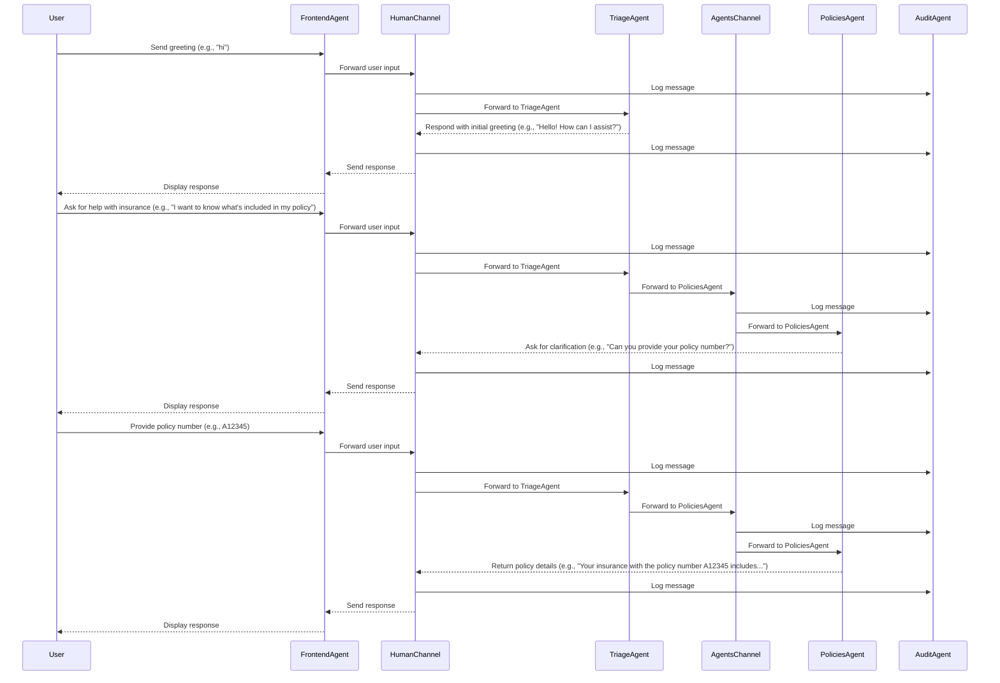

# Multi-Agent Insurance Support System

AI agents collaborate in a multi-agent system to provide effective and personalized insurance support.

The code for the example can be found [here](https://github.com/eggai-tech/EggAI/tree/main/examples/multi_agent_human_chat).

> **Note:** This example runs completely locally on your machine, including the language models via LM Studio. No cloud services or API keys are required to run the basic demo.

## User Interaction

Users interact with the system through a WebSocket-enabled chat interface.


## Architecture Overview


## Agents Overview

Agents collaborate with clear defined roles, objectives, and skills.

### **FrontendAgent**


**Role**: Serve the frontend and bridge WebSocket communication between the web frontend and human communication channel.  
**Objective**: Enable seamless interactions between users and agents through a WebSocket-enabled chat interface.  
**Skill**: Frontend service delivery, real-time communication, session management, message handling, and agent communication bridge.

### **TriageAgent**


**Role**: Classify incoming messages and route them to the appropriate agent based on content.  
**Objective**: Ensure that user inquiries are efficiently assigned to the right agent.  
**Skill**: Content classification and routing.

### **PoliciesAgent**


**Role**: Handle policy-related inquiries using a mock `policies_database`.  
**Objective**: Provide accurate and detailed information about user policies.  
**Skill**: Policy management expertise.

### **ClaimsAgent**


**Role**: Handle insurance claims inquiries and processing for customers.  
**Objective**: Retrieve claim status, file new claims, update existing claims, and answer claims-related questions.  
**Skill**: Claims processing, claim information management, and status reporting.

### **BillingAgent**


**Role**: Assist customers with billing-related inquiries such as due amounts, billing cycles, and payment statuses.  
**Objective**: Resolve billing-related questions efficiently and provide updates to billing records as needed.  
**Skill**: Billing expertise and data management.

### **EscalationAgent**


**Role**: Manage support ticket creation and retrieval for escalated issues that other agents cannot resolve.  
**Objective**: Ensure unresolved issues are properly documented and assigned to the correct human support teams.  
**Skill**: Escalation management and ticket tracking.

### **AuditAgent**


**Role**: Monitor all message traffic across channels for logging and auditing purposes.  
**Objective**: Provide visibility into agent communication by logging messages for debugging, analytics, and compliance.  
**Skill**: Channel-wide subscription, message auditing, log management, and extensibility for database or monitoring integration.  

## Communication Flow Example



## Getting Started

### Prerequisites

Ensure you have the following dependencies installed:

- **Python** 3.11
- **Docker** and **Docker Compose**

### Setup Instructions

Clone the EggAI repository:

```bash
git clone git@github.com:eggai-tech/EggAI.git
```

Move into the `examples/multi_agent_human_chat` folder:

```bash
cd examples/multi_agent_human_chat
```

Create and activate a virtual environment and install required dependencies:

```bash
make setup
source .venv/bin/activate  # On Windows: .venv\Scripts\activate
```

Configure Guardrails (Optional):

```bash
guardrails configure --token $GUARDRAILS_TOKEN
guardrails hub install hub://guardrails/toxic_language
```

Start the infrastructure components using Docker Compose:

```bash
make docker-up
```

This command starts the following services:
- [Redpanda](https://github.com/redpanda-data/redpanda) - Messaging platform for inter-agent communication
- Redpanda Console - Web UI for inspecting topics and messages
- OTEL Collector, Tempo, Prometheus - Telemetry and tracing infrastructure
- Grafana - Visualization dashboards for observability
- MinIO - S3-compatible object storage for MLflow artifacts
- MLflow - Tracking and registry for machine learning experiments
- PostgreSQL - Database for MLflow

You can access:
- Redpanda Console at http://localhost:8080
- Grafana at http://localhost:3000
- MLflow UI at http://localhost:5001
### Model Configuration

The system supports both cloud and local language models:

#### Using Local Models (Default)
By default, the system uses LM Studio as the local model server.

##### Setup Instructions:

1. Start a local model server with LM Studio:
   ```bash
   # Download and install LM Studio from https://lmstudio.ai/
   # Launch LM Studio and load the gemma-3-4b-it-qat model (or another compatible model)
   # Click "Local Server" in the sidebar and start the server
   # Ensure it's running on http://localhost:1234
   ```

2. Copy the `.env.example` file to create your `.env` file:
   ```bash
   cp .env.example .env
   ```

   The example configuration is already set up for LM Studio with the following settings:
   ```
   TRIAGE_LANGUAGE_MODEL_API_BASE=http://localhost:1234/v1/
   TRIAGE_LANGUAGE_MODEL=lm_studio/gemma-3-4b-it-qat

   POLICIES_LANGUAGE_MODEL_API_BASE=http://localhost:1234/v1/
   POLICIES_LANGUAGE_MODEL=lm_studio/gemma-3-4b-it-qat

   CLAIMS_LANGUAGE_MODEL_API_BASE=http://localhost:1234/v1/
   CLAIMS_LANGUAGE_MODEL=lm_studio/gemma-3-4b-it-qat

   BILLING_LANGUAGE_MODEL_API_BASE=http://localhost:1234/v1/
   BILLING_LANGUAGE_MODEL=lm_studio/gemma-3-4b-it-qat

   ESCALATION_LANGUAGE_MODEL_API_BASE=http://localhost:1234/v1/
   ESCALATION_LANGUAGE_MODEL=lm_studio/gemma-3-4b-it-qat

   LM_STUDIO_API_BASE=http://localhost:1234/v1/
   LM_STUDIO_API_KEY=lm-studio
   ```

Each agent can use a different model. All LiteLLM providers are supported, allowing you to mix local and cloud models as needed.

#### Using OpenAI (Alternative)
You can also use OpenAI models by uncommenting the relevant lines in your `.env` file:
```
# TRIAGE_LANGUAGE_MODEL=openai/gpt-4o-mini
# POLICIES_LANGUAGE_MODEL=openai/gpt-4o-mini
# CLAIMS_LANGUAGE_MODEL=openai/gpt-4o-mini
# BILLING_LANGUAGE_MODEL=openai/gpt-4o-mini
# ESCALATION_LANGUAGE_MODEL=openai/gpt-4o-mini
```

Don't forget to also set your OpenAI API key:
```
OPENAI_API_KEY=your-api-key-here
```


### Run the Example

```bash
make start-all
```

Upon running the example and accessing the chat interface at [http://localhost:8000](http://localhost:8000), you should see a web-based chat UI.

### Code Quality and Testing

#### Linting

The project uses Ruff for linting to ensure code quality. You can run the linter using:

```bash
make lint        # Check for linting errors
make lint-fix    # Fix auto-fixable linting issues
```

#### Testing

You can execute tests to validate the behavior of different agents using evaluation methods like LLM-as-a-Judge.

To run all tests:

```bash
make test
```

Running Specific Agent Tests:

```bash
make test-audit-agent        # Runs tests for the Audit Agent
make test-billing-agent      # Runs tests for the Billing Agent
make test-escalation-agent   # Runs tests for the Escalation Agent
make test-frontend-agent     # Runs tests for the Frontend Agent
make test-policies-agent     # Runs tests for the Policies Agent
make test-triage-agent       # Runs tests for the Triage Agent
```

You can optimize agents using DSPy evaluation and optimization techniques.
You can find an optimization setup [here](https://github.com/eggai-tech/EggAI/blob/main/examples/multi_agent_human_chat/agents/triage/tests/test_dspy_modules.py).

When running the tests for the Triage Agent, a DSPy performance report will be generated in the `agents/triage/dspy_modules/evaluation/reports` folder ([example report](https://github.com/eggai-tech/EggAI/blob/main/examples/multi_agent_human_chat/agents/triage/dspy_modules/evaluation/reports/classifier_v1.html)).

#### DSPy COPRO Optimization

You can use COPRO (Constrained PROmpt optimization) to optimize agent prompts:

```bash
# Optimize Individual Components
make compile-triage-classifier-v2  # Optimizes the Triage Classifier v2
make compile-triage-classifier-v4  # Optimizes the Triage Classifier v4 (zero-shot)
make compile-billing-optimizer     # Optimizes the Billing Agent prompt
make compile-claims-optimizer      # Optimizes the Claims Agent prompt
make compile-policies-optimizer    # Optimizes the Policies Agent prompt

# Optimize All Components at Once
make compile-all                   # Runs all optimizers sequentially with automatic confirmation
```

These commands use COPRO to optimize agent prompts based on synthetic datasets and precision metrics. The optimization results are stored as JSON files and logged to MLflow. Once optimized, agents will automatically load and use these optimized prompts when running.

Once optimized, the agents will automatically load and use these optimized prompts to improve their performance.

### Custom Model Training and Evaluation
In order to improve the response latency and cost of the Triage Agent, you can train a custom classifier to classify the incoming messages. 
The training and test data has been generated via our data generation scripts.
A short exploratory data analysis consisting train/test class distribution and data visualization can be found in [exploratory_data_analysis.ipynb](agents/triage/notebooks/exploratory_data_analysis.ipynb).

One can play around with the notebook by running the Jupyter server:

```
make start-eda-notebook
```

Here are two plots showing the t-SNE projection of the message embeddings and the class distribution of the training and test data:


#### Model Architecture, Training and Evaluation

Specifically, our custom model is a simple few-shot logistic regression model trained on the message embeddings. The embeddings
were computed using the `sentence-transformers/all-MiniLM-L6-v2` model. See [Sentence Transformers](https://www.sbert.net/) for more details.

In order to train the model:

1. Create the `.env` file containing the following variables:

```
FEWSHOT_N_EXAMPLES=100
AWS_ACCESS_KEY_ID=user
AWS_SECRET_ACCESS_KEY=password
MLFLOW_TRACKING_URI=http://localhost:5001
MLFLOW_S3_ENDPOINT_URL=http://localhost:9000
```
One can train several models with different number of examples per class by setting the `FEWSHOT_N_EXAMPLES` variable to the desired number of examples.
For each `FEWSHOT_N_EXAMPLES` we used 3 different random seeds to sample the examples.
This means that each model is an ensemble of 3 models trained on different random samples of the training set.
The average of the predictions of the 3 models is used as the final prediction.


If you want to train the model with **all training data**, just remove the `FEWSHOT_N_EXAMPLES` variable from the `.env` file.

2. Run the training script:

```bash
make train-triage-classifier-v3
```

Ideally run this command several times with different `FEWSHOT_N_EXAMPLES` values to train several models with different number of examples per class and compare the results in [MLFlow UI](http://localhost:5001).
Here's a screenshot from the MLFlow UI comparing 3 models trained with `n=10`, `n=100` and `n=all` examples per class:


### Cleaning Up

Stop and remove Docker containers and delete venv:

```bash
make docker-down
make clean
```

## Next Steps

- **Extend Functionality**: Add new agents or tools to handle more complex workflows.
- **Connect Real Data**: Integrate the system with external databases or APIs.
- **Enhance UI**: Improve the chat interface with features like authentication and message history.
- **Learn More**: Explore other examples in the `examples` folder for advanced patterns.
- **Contribute**: Share feedback or improvements with the EggAI community.
