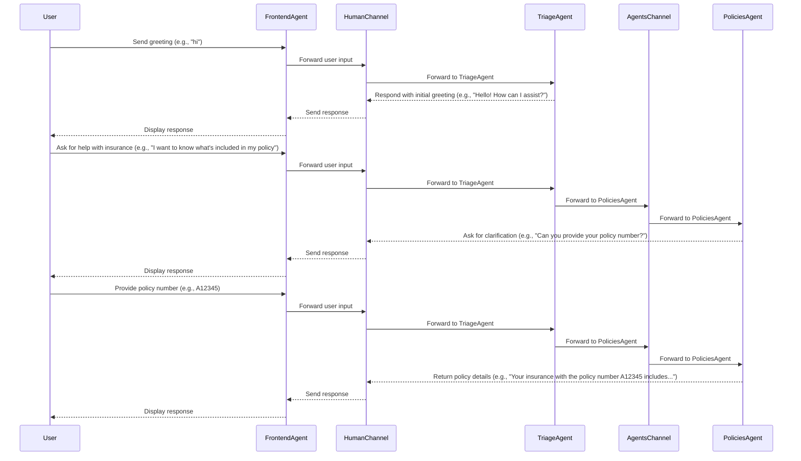

# Multi-Agent Insurance Support System

AI agents collaborate in a multi-agent system to provide effective and personalized insurance support.

The code for the example can be found [here](https://github.com/eggai-tech/EggAI/tree/main/examples/multi_agent_human_chat).

## User Interaction

Users interact with the system through a WebSocket-enabled chat interface.


## Architecture Overview


## Agents Overview

Agents collaborate with clear defined roles, objectives and skills.

### **FrontendAgent**


**Role**: Serve the frontend and bridge WebSocket communication between web frontend and human communication channel.  
**Objective**: Enable seamless interactions between users and agents through a WebSocket-enabled chat interface.  
**Skill**: Frontend service delivery, Real-time communication, session management, message handling, and agent communication bridge.

### **TriageAgent**


**Role**: Classify incoming messages and route them to the appropriate agent based on content.  
**Objective**: Ensure that user inquiries are efficiently assigned to the right agent.  
**Skill**: Content classification and routing.

### **PoliciesAgent**


**Role**: Handle policy-related inquiries using a mock `policies_database`.  
**Objective**: Provide accurate and detailed information about user policies.  
**Skill**: Policy management expertise.

### **BillingAgent**


**Role**: Assist customers with billing-related inquiries such as due amounts, billing cycles, and payment statuses.  
**Objective**: Resolve billing-related questions efficiently and provide updates to billing records as needed.  
**Skill**: Billing expertise and data management.

### **EscalationAgent**


**Role**: Manage support ticket creation and retrieval for escalated issues that other agents cannot resolve.  
**Objective**: Ensure unresolved issues are properly documented and assigned to the correct human support teams.  
**Skill**: Escalation management and ticket tracking.

### Communication Flow Example



## Getting Started

### Prerequisites

Ensure you have the following dependencies installed:

- **Python** 3.12
- **Docker** and **Docker Compose**

Ensure you have a valid OpenAI API key set in your environment:

```bash
export OPEN_AI_API_KEY="your-api-key"
export GUARDRAILS_TOKEN="your-guardrails-ai-token" # Optional
```

### Setup Instructions

Clone the EggAI repository:

```bash
git clone git@github.com:eggai-tech/EggAI.git
```

Move into the `examples/multi_agent_human_chat` folder:

```bash
cd examples/multi_agent_human_chat
```

Create and activate a virtual environment and install required dependencies:

```bash
make setup
```

Configure Guardrails (Optional):

```bash
guardrails configure --token $GUARDRAILS_TOKEN
guardrails hub install hub://guardrails/toxic_language
```

Start [Redpanda](https://github.com/redpanda-data/redpanda) using Docker Compose:

```bash
make docker-up
```

### Run the Example

```bash
make start-all
```

Upon running the example and accessing the chat interface at [http://localhost:8000](http://localhost:8000), you should see a web-based chat UI.

### Testing

You can execute tests to validate the behavior of different agents.

To run all tests:

```bash
make test
```

Running Specific Agent Tests:
```bash
make test-billing      # Runs tests for the Billing Agent
make test-escalation   # Runs tests for the Escalation Agent
make test-frontend     # Runs tests for the Frontend Agent
make test-policies     # Runs tests for the Policies Agent
make test-triage       # Runs tests for the Triage Agent
```

### Cleaning Up

Stop and remove Docker containers and delete venv:

```bash
make docker-down
make clean
```

## Next Steps

- **Extend Functionality**: Add new agents or tools to handle more complex workflows.
- **Connect Real Data**: Integrate the system with external databases or APIs.
- **Enhance UI**: Improve the chat interface with features like authentication and message history.
- **Learn More**: Explore other examples in the `examples` folder for advanced patterns.
- **Contribute**: Share feedback or improvements with the EggAI community.
