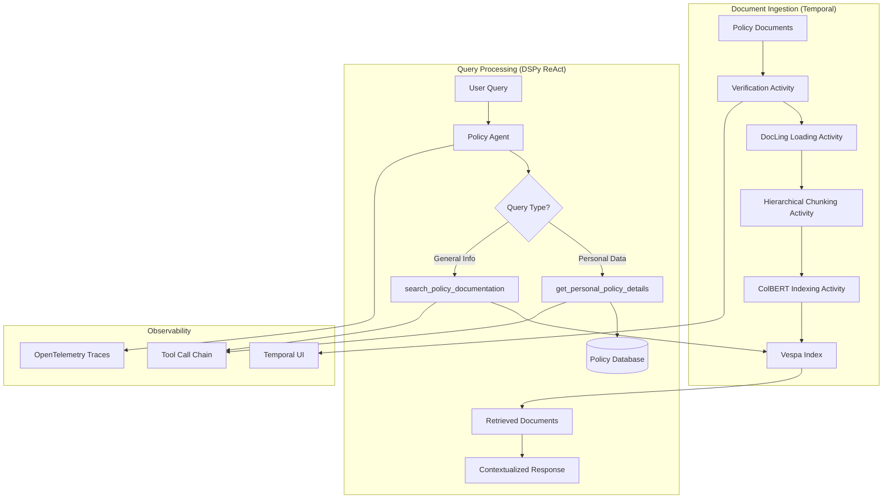
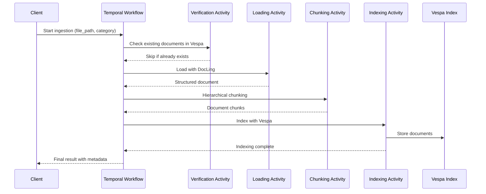
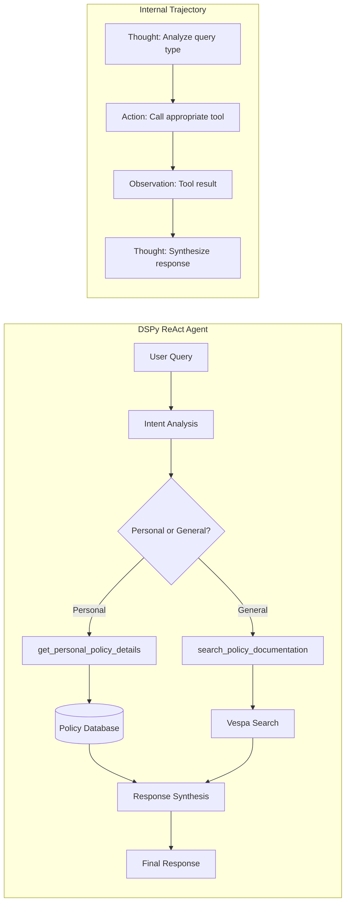
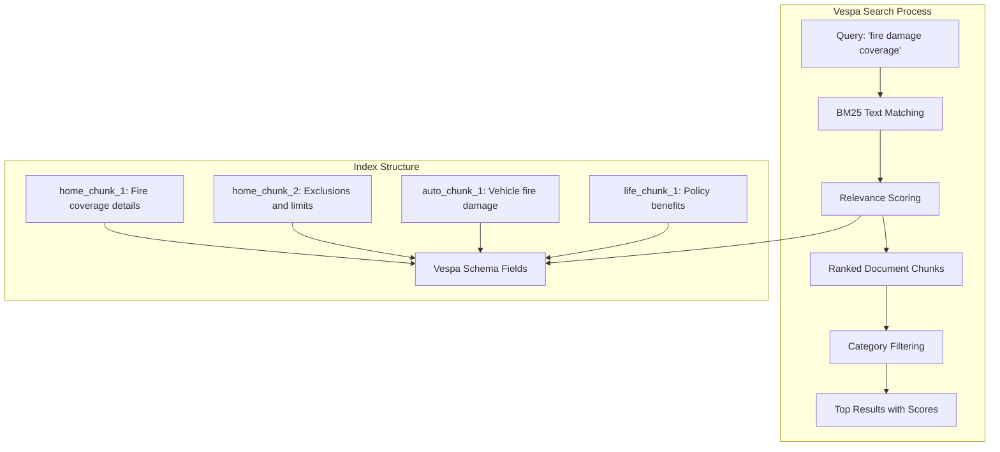

# Multi-Agent Policy System: Temporal + Vespa + ReAct Architecture

A sophisticated insurance policy system combining **Temporal workflows** for durable document ingestion, **Vespa** for semantic search, and **DSPy ReAct agents** for intelligent policy assistance.

## 🏗️ System Architecture Overview



## 🚀 Why This Architecture?

### Temporal for Ingestion: Durable Long-Running Processes

Document ingestion involves multiple complex steps that can fail:
- **PDF parsing** with DocLing can timeout on large documents
- **Chunking operations** require significant memory for hierarchical processing  
- **Vespa indexing** involves network operations and schema validation
- **Network failures** during index uploads to distributed storage

**Temporal provides:**
- ✅ **Automatic retries** with exponential backoff
- ✅ **State persistence** - resume from any failed step
- ✅ **Fault tolerance** - survive worker crashes and restarts
- ✅ **Observability** - complete audit trail of ingestion processes
- ✅ **Scalability** - distribute activities across multiple workers

### ReAct for Intelligence: Tool-Using AI Agents

Traditional chatbots can't reliably choose between different data sources. Our ReAct agent:

- 🧠 **Reasons about query intent** - personal vs. general policy questions
- 🔧 **Selects appropriate tools** - database lookup vs. document search  
- 📝 **Maintains conversation context** - builds on previous interactions
- 🔄 **Iterates when needed** - can call multiple tools in sequence
- 📊 **Provides citations** - includes document references and metadata

## 📋 Document Ingestion Pipeline

### Temporal Workflow: 4-Stage Processing



### Stage Details

#### 1. Document Verification Activity
```python
# agents/ingestion/workflows/activities/document_verification_activity.py
def verify_document_activity(file_path: str, index_name: str, force_rebuild: bool) -> Dict[str, Any]:
    """
    - Checks Vespa index for existing documents by source_file
    - Supports force_rebuild to skip verification  
    - Prevents duplicate processing of same documents
    """
```

#### 2. Document Loading Activity  
```python
# agents/ingestion/workflows/activities/document_loading_activity.py  
def load_document_activity(input: DocumentLoadingInput) -> DocumentLoadingResult:
    """
    - Uses DocLing DocumentConverter for PDF/markdown parsing
    - Extracts structured content with page metadata
    - Handles various document formats (PDF, MD, DOCX)
    """
```

#### 3. Document Chunking Activity
```python
# agents/ingestion/workflows/activities/document_chunking_activity.py
def chunk_document_activity(input: DocumentChunkingInput) -> DocumentChunkingResult:
    """
    - DocLing HierarchicalChunker with GPT-2 tokenizer
    - Config: max_tokens=500, min_tokens=100, overlap_sentences=2
    - Respects sentence boundaries for semantic coherence
    """
```

#### 4. Document Indexing Activity
```python
# agents/ingestion/workflows/activities/document_indexing_activity.py
def index_document_activity(chunks_data: List[Dict], file_path: str, category: str) -> Dict[str, Any]:
    """
    - Vespa search engine with BM25 text indexing
    - Stores documents with schema: id, title, text, category, chunk_index, source_file
    - Supports semantic search and category filtering
    """
```

## 🤖 ReAct Agent: Tool-Using Intelligence

### Agent Architecture



### Tool Calling Chain & Trajectory

The ReAct agent maintains an internal **trajectory** of reasoning steps:

```python
# Example internal trajectory for: "What's my premium for A12345?"

trajectory = [
    {
        "step": 1,
        "type": "thought", 
        "content": "User asking about premium for policy A12345. This is personal policy data requiring policy lookup."
    },
    {
        "step": 2,
        "type": "action",
        "tool": "get_personal_policy_details",
        "input": {"policy_number": "A12345"}
    },
    {
        "step": 3, 
        "type": "observation",
        "content": '{"policy_number": "A12345", "name": "John Doe", "premium_amount_usd": "$500.00", "due_date": "2026-03-01"}'
    },
    {
        "step": 4,
        "type": "thought",
        "content": "I have the policy details. Need to format response with name, amount, and date."
    },
    {
        "step": 5,
        "type": "final_response", 
        "content": "Hello John Doe, your premium for policy A12345 is $500.00 and it's due on 2026-03-01."
    }
]
```

### Decision Logic Implementation

```python
# agents/policies/dspy_modules/policies.py - PolicyAgentSignature
class PolicyAgentSignature(dspy.Signature):
    """
    DECISION LOGIC - Choose the right tool:

    PERSONAL POLICY QUERIES (use get_personal_policy_details):
    - User asks about "my policy" AND provides policy number (A12345)
    - Questions about premium payments, due dates, personal details
    - REQUIRED: Policy number must be in current message

    GENERAL POLICY QUESTIONS (use search_policy_documentation):  
    - User asks about coverage, policy rules, what's covered
    - No personal policy number needed or provided
    - Examples: "What does fire damage cover?", "How does auto insurance work?"
    """
```

### Tool Implementations

#### Personal Policy Tool
```python
# agents/policies/dspy_modules/policies_data.py
def get_personal_policy_details(policy_number: str) -> str:
    """
    - Retrieves specific policy data from in-memory database
    - Returns JSON with policy_number, name, category, premium, due_date
    - Used for: premium inquiries, payment dates, personal policy info
    """
```

#### Documentation Search Tool  
```python
def search_policy_documentation(query: str, category: str = None) -> str:
    """
    - Calls Vespa search with BM25 text matching and optional category filtering
    - Searches indexed policy documents with relevance scoring
    - Returns top results with content, scores, and metadata
    - Used for: coverage questions, policy explanations, general info
    """
```

## 🔍 Search System: Vespa BM25 Text Search

### Vespa Integration



### Retrieval Implementation

```python
# agents/policies/retrieving.py
def retrieve_policies(query: str, category: str = None) -> List[Dict]:
    """
    Vespa-powered BM25 text search:
    
    1. Connect to Vespa search engine
    2. Execute BM25 text search with category filtering  
    3. Return ranked results with:
       - content: Document chunk text
       - score: BM25 relevance score
       - document_id: Unique chunk identifier
       - document_metadata: Category, chunk_index, source_file
    """
```

### Search Result Format
```json
[
  {
    "content": "The Insurer agrees to indemnify the Insured for loss or damage to the insured property arising from fire...",
    "score": 0.15,
    "document_id": "home_chunk_4",
    "document_metadata": {
      "category": "home",
      "chunk_index": 4,
      "source_file": "home.md"
    }
  }
]
```

## 🚀 Getting Started

### 1. Start Complete System
```bash
make start
```

This launches:
- **Temporal Server** (workflow orchestration)
- **Policy Documentation Worker** (ingestion activities) 
- **All Insurance Agents** (including policies ReAct agent)
- **Supporting Services** (PostgreSQL, monitoring)

### 2. Verify System Health
```bash
# Test ingestion workflow
python agents/ingestion/start_worker.py

# Test ReAct agent  
python -c "
from agents.policies.dspy_modules.policies import policies_model
result = policies_model(chat_history='User: What does fire damage cover?')
print(result.final_response)
"
```

### 3. Example Usage Patterns

#### Personal Policy Queries
```python
# Query requiring policy number - uses database lookup
query = "User: What's my premium for policy A12345?"
result = policies_model(chat_history=query)
# Response: "Hello John Doe, your premium for policy A12345 is $500.00..."
```

#### General Policy Questions
```python  
# Query about coverage - uses Vespa search
query = "User: What does fire damage cover in home insurance?"
result = policies_model(chat_history=query)
# Response: "According to our Standard Home Insurance Policy, the Insurer agrees to indemnify..."
```

#### Privacy Protection
```python
# Query without policy number - asks for it
query = "User: What's my premium payment?"  
result = policies_model(chat_history=query)
# Response: "To provide your personal policy information, I need your policy number..."
```

## 📊 Observability & Monitoring

### Temporal Workflow Monitoring
- **Web UI**: http://localhost:8081
- **Workflow History**: Complete execution trace for each ingestion
- **Activity Status**: Real-time progress of verification, loading, chunking, indexing
- **Error Details**: Stack traces and retry attempts for failed activities

### ReAct Agent Tracing  
```python
# OpenTelemetry spans capture:
# - Tool selection reasoning
# - Tool call inputs/outputs  
# - LM prompts and responses
# - Final response synthesis

with tracer.start_as_current_span("policies_react") as span:
    span.set_attribute("query_type", "personal_policy")
    span.set_attribute("tools_called", ["get_personal_policy_details"])
    span.set_attribute("policy_number", "A12345")
```

### Key Metrics
- **Ingestion Success Rate**: >99% with Temporal retries
- **Tool Selection Accuracy**: Correct tool chosen for query type
- **Vespa Search Latency**: 10-50ms for BM25 text search
- **End-to-End Response Time**: <2s for database, <3s for Vespa queries

## 🏗️ Advanced Configuration

### Temporal Workflows
```python
# agents/ingestion/workflows/worker.py
class PolicyDocumentationWorkerSettings:
    temporal_server_url: str = "localhost:7233"
    temporal_namespace: str = "default"
    temporal_task_queue: str = "policy-rag"
    
    # Activity retry policies
    verification_max_attempts: int = 3
    loading_timeout_seconds: int = 300  
    chunking_max_attempts: int = 5
    indexing_timeout_seconds: int = 600
```

### Vespa Index Configuration
```python
# Vespa schema settings in indexing activities
vespa_config = {
    "schema_name": "policy_document",
    "max_document_length": 500,  # tokens per chunk
    "overlap": 2,  # sentence overlap between chunks
    "vespa_url": "http://localhost:8080",
    "ranking_profile": "default"
}
```

### ReAct Agent Tuning
```python
# agents/policies/dspy_modules/policies.py
policies_model = TracedReAct(
    PolicyAgentSignature,
    tools=[get_personal_policy_details, search_policy_documentation],
    max_iters=5,  # max reasoning steps
    name="policies_react",
    tracer=policies_tracer,
)
```

## 🔧 Development & Extension

### Adding New Document Types
1. **Create policy markdown** in `agents/ingestion/documents/`
2. **Update category enum** in type definitions
3. **Run ingestion** with new category parameter
4. **Test retrieval** with category filtering

### Custom Activities
```python
# agents/ingestion/workflows/activities/custom_activity.py
@activity.defn(name="custom_processing")
async def custom_activity(input: CustomInput) -> CustomResult:
    # Your custom document processing logic
    return CustomResult(success=True, processed_count=len(results))
```

### Extended Tool Integration
```python
# Add new tools to ReAct agent
new_tools = [
    get_personal_policy_details,
    search_policy_documentation, 
    calculate_premium_estimates,  # New tool
    check_claim_status,          # New tool
]

policies_model = TracedReAct(
    PolicyAgentSignature,
    tools=new_tools,
    max_iters=8,  # More iterations for complex tool chains
)
```

## 🔗 Learn More

- **Temporal Workflows**: [docs.temporal.io](https://docs.temporal.io/)
- **DSPy ReAct Agents**: [dspy-docs.vercel.app](https://dspy-docs.vercel.app/)  
- **Vespa Search Engine**: [docs.vespa.ai](https://docs.vespa.ai/)
- **DocLing Document AI**: [ds4sd.github.io/docling](https://ds4sd.github.io/docling/)

---

This architecture demonstrates how **durable workflows**, **text search**, and **reasoning agents** can combine to create robust, observable, and intelligent document processing systems.