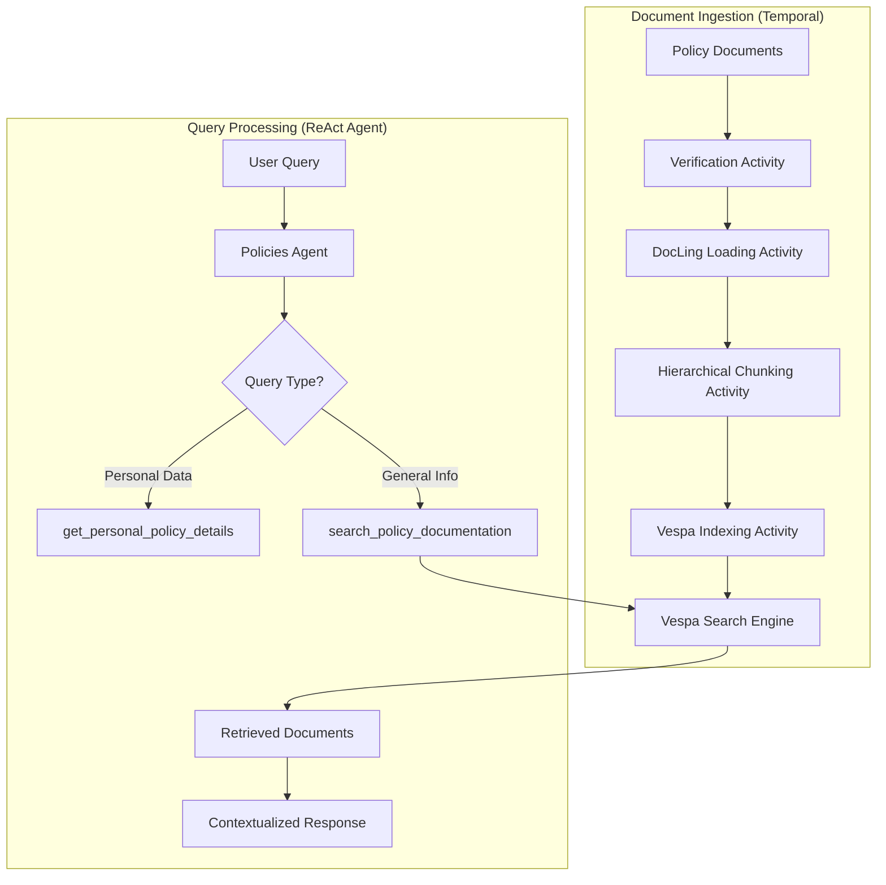

# Document Ingestion Pipeline

This document explains the Temporal-based ingestion pipeline that powers the Policies Agent's RAG (Retrieval-Augmented Generation) system.

## Overview

The ingestion pipeline uses **Temporal workflows** to orchestrate durable, fault-tolerant document processing. Documents are parsed, chunked, and indexed into **Vespa** for semantic search.

## Architecture



## Why Temporal?

Document ingestion is a complex multi-step process that requires:

- **Durability**: Resume from failures without losing progress
- **Retries**: Automatic retry with exponential backoff
- **Observability**: Complete audit trail of all processing steps
- **Scalability**: Distribute activities across multiple workers

## Ingestion Pipeline Stages

### 1. Document Verification

```python
# Checks if document already exists in Vespa
# Prevents duplicate processing
# Supports force_rebuild flag
```

### 2. Document Loading (DocLing)

```python
# Uses DocLing DocumentConverter
# Supports PDF, Markdown, DOCX formats
# Extracts structured content with metadata
```

### 3. Hierarchical Chunking

```python
# GPT-2 tokenizer with smart boundaries
# Config: max_tokens=500, min_tokens=100
# Preserves semantic coherence
# 2-sentence overlap between chunks
```

### 4. Vespa Indexing

```python
# BM25 text search with category filtering
# Schema: id, title, text, category, source_file
# Supports relevance scoring
```

## Running the Ingestion

### Start the Worker

```bash
# Start Temporal and Vespa services
make docker-up

# Start the ingestion worker
make start-policies-document-ingestion
```

### Trigger Ingestion

Documents in `agents/policies/ingestion/documents/` are automatically ingested on startup:

- `auto.md` - Auto insurance policies
- `home.md` - Home insurance policies  
- `health.md` - Health insurance policies
- `life.md` - Life insurance policies

### Monitor Progress

- **Temporal UI**: http://localhost:8081
- **Vespa Status**: http://localhost:19071

## Vespa Search Integration

### Query Format

```python
# BM25 text search with optional category filter
results = retrieve_policies(
    query="fire damage coverage",
    category="home"  # Optional
)
```

### Result Structure

```json
{
  "content": "The Insurer agrees to indemnify...",
  "score": 0.85,
  "document_id": "home_chunk_4",
  "document_metadata": {
    "category": "home",
    "chunk_index": 4,
    "source_file": "home.md"
  }
}
```

## ReAct Agent Integration

The Policies Agent uses a ReAct (Reasoning + Acting) pattern with two tools:

### Tool 1: Personal Policy Lookup

```python
get_personal_policy_details(policy_number: str)
# Returns specific policy data from database
# Used for: premiums, due dates, personal info
```

### Tool 2: Document Search

```python
search_policy_documentation(query: str, category: str = None)
# Searches Vespa-indexed policy documents
# Used for: coverage questions, general info
```

### Decision Logic

The agent analyzes queries to determine:

- **Personal queries**: Require policy number (e.g., "What's my premium for A12345?")
- **General queries**: Search documentation (e.g., "What does fire damage cover?")

## Configuration

### Temporal Settings

```yaml
# agents/policies/ingestion/config.py
temporal_server_url: "localhost:7233"
temporal_namespace: "default"
temporal_task_queue: "policy-rag"
```

### Vespa Configuration

```yaml
# Chunking parameters
max_tokens: 500
min_tokens: 100
overlap_sentences: 2

# Search settings
vespa_url: "http://localhost:8080"
schema_name: "policy_document"
```

## Adding New Documents

1. Add markdown file to `agents/policies/ingestion/documents/`
2. Update category enum if needed
3. Restart the ingestion worker
4. Documents will be automatically processed

---

**Previous:** [ReAct Framework with DSPy](react-framework-dspy.md) | **Next:** [RAG with Vespa](agentic-rag.md)