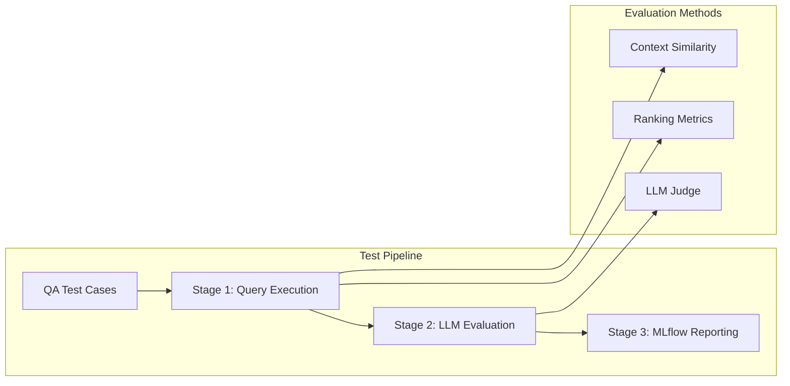

# Retrieval Performance Testing

This document describes the comprehensive test suite for evaluating the quality of the Policies Agent's document retrieval system using context-based similarity metrics and LLM judges.

## Overview

The retrieval performance test suite evaluates how well the Vespa-powered search system retrieves relevant policy documentation. It uses real QA pairs from insurance policy documents and measures performance using both context similarity and LLM-based evaluation.

## Architecture



## Evaluation Metrics

### Context-Based Metrics

#### Recall/Hit Rate
- **Purpose**: Measures whether relevant context was found
- **Range**: 0.0 - 1.0 (binary: found or not found)
- **Good Performance**: > 0.8

#### Context Coverage
- **Purpose**: Measures completeness of the best matching chunk
- **Range**: 0.0 - 1.0 (similarity score)
- **Good Performance**: > 0.6

### Ranking Metrics

#### Precision@k
- **Purpose**: Precision of top-k results
- **Default**: k=5, relevance threshold=0.5
- **Good Performance**: > 0.6

#### Mean Reciprocal Rank (MRR)
- **Purpose**: Quality of ranking with emphasis on top results
- **Range**: 0.0 - 1.0
- **Good Performance**: > 0.7

#### nDCG (Normalized Discounted Cumulative Gain)
- **Purpose**: Overall ranking quality considering position
- **Default**: k=10
- **Good Performance**: > 0.7

### Position-Based Hit Rates
- **Hit Rate @ Top-1**: % of queries with best result first
- **Hit Rate @ Top-3**: % of queries with best result in top 3
- **Hit Rate @ Top-5**: % of queries with best result in top 5

### LLM Judge Metrics

#### Retrieval Quality Score
- **Scale**: 0.0 - 1.0
  - 0.9-1.0: Excellent
  - 0.7-0.8: Good
  - 0.5-0.6: Adequate
  - 0.3-0.4: Poor
  - 0.0-0.2: Inadequate
- **Pass Threshold**: ≥ 0.7

#### Completeness Score
- **Purpose**: Information completeness for answering
- **Range**: 0.0 - 1.0

#### Relevance Score
- **Purpose**: Relevance of chunks to question
- **Range**: 0.0 - 1.0

## Running Performance Tests

### Prerequisites
```bash
# Ensure Vespa is running and documents are indexed
make docker-up
make start-policies-document-ingestion
```

### Run Tests with LLM Judge (Default)
```bash
# Requires OpenAI API key in .env
make test-policies-retrieval-performance
```

### Run Tests Without LLM Judge
```python
# In your test configuration
config = RetrievalTestConfiguration(enable_llm_judge=False)
```

## Configuration Options

### Search Types
- `hybrid`: Combines keyword and vector search
- `keyword`: Traditional keyword-based search
- `vector`: Semantic vector search

### Max Hits Values
- `1`: Retrieve only top result
- `5`: Retrieve top 5 results
- `10`: Retrieve top 10 results

### Test Data
Located in `agents/policies/tests/retrieval_performance/filtered_qa_pairs.json`:
```json
{
  "question": "What is covered under fire damage?",
  "answer": "Fire damage covers...",
  "context": "The policy covers damage from fire...",
  "source_document": "home.md"
}
```

## Viewing Results

Results are logged to MLflow under experiment `retrieval_performance_evaluation`:

1. **Access MLflow UI**: http://localhost:5001
2. **Navigate to**: Experiments → retrieval_performance_evaluation
3. **Key Metrics**:
   - `avg_recall_score`: Overall hit rate
   - `avg_context_coverage`: Content matching quality
   - `avg_mrr_score`: Ranking effectiveness
   - `hit_rate_top_1`: First-result accuracy

## Performance Benchmarks

### Good Performance
- Recall Score: > 80%
- Context Coverage: > 60%
- MRR Score: > 70%
- Hit Rate @ Top-1: > 50%

### Warning Signs
- Recall < 50%: Missing relevant content
- Context Coverage < 30%: Poor matching
- MRR < 30%: Results buried deep
- Hit Rate @ Top-1 < 20%: Poor ranking

## Troubleshooting

### Common Issues

1. **Low Context Coverage**
   - Check chunk size configuration
   - Verify document preprocessing

2. **High Recall, Low MRR**
   - Content found but poorly ranked
   - Adjust ranking algorithm parameters

3. **Zero Scores**
   - Verify Vespa connectivity
   - Check document indexing status

4. **LLM Judge Failures**
   - Verify OpenAI API key
   - Check rate limits

## Integration with CI/CD

```yaml
# Example GitHub Actions integration
- name: Run Retrieval Performance Tests
  run: |
    make test-policies-retrieval-performance
    python scripts/check_performance_thresholds.py
```

## Extending the Test Suite

### Adding Test Cases
1. Add QA pairs to `filtered_qa_pairs.json`
2. Include question, answer, context, and source
3. Run test suite to evaluate

### Custom Metrics
```python
# In evaluator.py
def custom_metric(retrieved_chunks, expected_context):
    # Your custom evaluation logic
    return score
```

## Related Documentation

- [Ingestion Pipeline](ingestion-pipeline.md) - How documents are processed
- [Agents Overview](agents-overview.md) - Policies Agent details
- MLflow Docs: https://mlflow.org