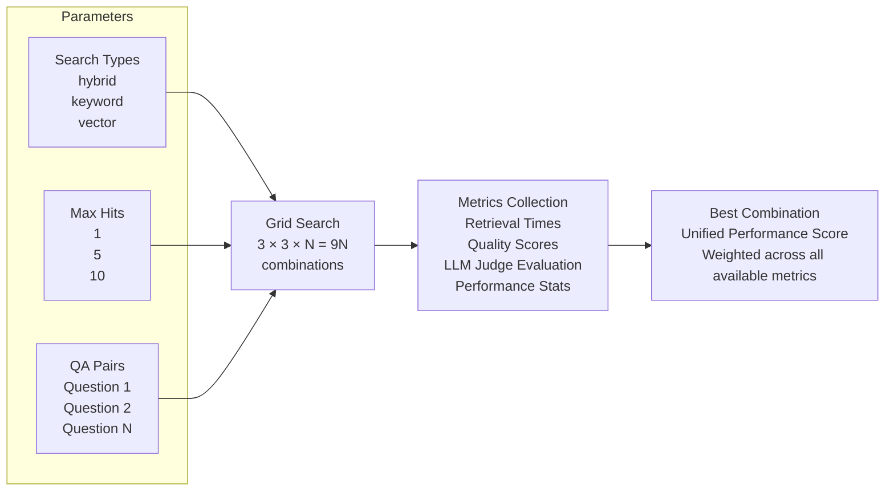

# Retrieval Performance Testing

This document describes the comprehensive test suite for evaluating the quality of the Policies Agent's document retrieval system using a unified performance calculator with configurable metrics and weights.

## Overview

The retrieval performance test suite evaluates how well the Vespa-powered search system retrieves relevant policy documentation. It features:

- **Unified Performance Calculator**: Single scoring system that adapts to available metrics
- **Configurable Metrics**: 11 metrics across 4 categories with customizable weights
- **Adaptive Scoring**: Works with or without LLM judge evaluation
- **End-to-End Testing**: Automatic Vespa deployment, document ingestion, and service startup
- **Actionable Results**: Clear recommendations based on comprehensive performance analysis

## Hyper-Parameter Grid Search



## Unified Performance Calculator

The system uses a sophisticated, configurable performance calculator that adapts to available metrics and provides consistent scoring regardless of evaluation mode.

### Metric Categories & Weights

#### Retrieval Metrics (30% total weight)

Core performance metrics always available:

- **`success_rate`** (15%): Percentage of queries returning results without errors
- **`avg_total_hits`** (10%): Average number of documents retrieved per query
- **`avg_retrieval_time`** (5%): Average response time in milliseconds

#### LLM Judge Metrics (40% total weight - when enabled)

AI-powered quality assessment:

- **`avg_quality_score`** (20%): LLM-judged overall quality (0.0-1.0)
- **`pass_rate`** (15%): Percentage passing LLM quality threshold (≥0.7)
- **`avg_completeness_score`** (5%): Content completeness for answering

#### Context Metrics (20% total weight - when LLM enabled)

Context-based similarity and relevance:

- **`avg_recall_score`** (8%): Whether relevant context was found
- **`avg_precision_at_k`** (7%): Precision of top-K results (K=5)
- **`avg_ndcg_score`** (5%): Normalized Discounted Cumulative Gain

#### Position Metrics (10% total weight - when LLM enabled)

Ranking quality and position analysis:

- **`avg_best_position`** (5%): Average position of best matching result
- **`hit_rate_top_3`** (5%): Percentage with relevant results in top 3

### Adaptive Scoring Modes

#### Retrieval-Only Mode (No LLM Judge)

```bash
• Active Metrics: 3 (retrieval category only)
• Weight Distribution: Retrieval 100%
• Use Case: Fast performance testing, CI/CD pipelines
• Focus: Speed, availability, basic hit metrics
```

#### Full Evaluation Mode (With LLM Judge)

```bash
• Active Metrics: 11 (all categories)
• Weight Distribution: 
  - Retrieval: 30%
  - LLM Judge: 40% 
  - Context: 20%
  - Position: 10%
• Use Case: Comprehensive quality assessment
• Focus: Quality, relevance, ranking effectiveness
```

### Performance Score Calculation

1. **Metric Normalization**: All metrics normalized to 0.0-1.0 scale
2. **Weight Application**: Each normalized metric multiplied by its weight
3. **Score Aggregation**: Weighted sum produces final score (0.0-1.0)
4. **Automatic Adaptation**: Weights automatically re-normalized based on available metrics

### Quality Thresholds

- **Excellent**: ≥ 0.8 - Outstanding performance across all metrics
- **Good**: 0.6-0.8 - Solid performance, minor optimization opportunities  
- **Moderate**: 0.4-0.6 - Acceptable but needs parameter tuning
- **Poor**: < 0.4 - Significant optimization required

## Running Performance Tests

### Prerequisites

**Environment Requirements:**

- Ensure all required environment variables are set in `.env`
- Vespa and Kafka services must be running
- Tests perform automatic end-to-end setup:
  - Vespa schema deployment and verification
  - Sample document ingestion from `agents/policies/ingestion/documents/`
  - Embedded service startup on random port (10000-11000)
  - Infrastructure connectivity checks

```bash
# Start required infrastructure
make docker-up

# Optional: View logs during test execution
docker logs -f vespa-container
```

### Run Tests with LLM Judge (Default)

```bash
# Requires OpenAI API key in .env
make test-policies-retrieval-performance
```

### Run Tests Without LLM Judge

```python
# Configure the test to skip LLM evaluation
config = RetrievalTestConfiguration(enable_llm_judge=False)
tester = RetrievalPerformanceTester(config=config)
```

## Test Flow

The test follows an end-to-end 5-stage pattern:

1. **Infrastructure Setup**: 
   - Deploy Vespa schema with enhanced logging
   - Verify Kafka and Vespa connectivity
   - Ingest sample documents with filename-based categorization
   - Start embedded API service on random port

2. **Stage 1 - Collect Results**: Execute all retrieval queries for parameter combinations
3. **Stage 2 - Generate Metrics**: Calculate basic performance metrics from results
4. **Stage 3 - LLM Judge (Optional)**: Evaluate quality using LLM judge if enabled
5. **Stage 4 - Report to MLflow**: Log all results and metrics to MLflow experiment
6. **Performance Analysis**: Use unified calculator to find best combination and provide recommendations

## Configuration Options

### Search Types

- `hybrid`: Combines keyword and vector search
- `keyword`: Traditional keyword-based search
- `vector`: Semantic vector search

### Max Hits Values

- `1`: Retrieve only top result
- `5`: Retrieve top 5 results
- `10`: Retrieve top 10 results

### Worker Configuration
- `max_query_workers`: Parallel query execution (default: 5)
- `max_eval_workers`: Parallel LLM evaluation (default: 3)

### Test Data

**Sample Documents** (Auto-ingested during test):

- `agents/policies/ingestion/documents/life.md` → category: "life"
- `agents/policies/ingestion/documents/auto.md` → category: "auto" 
- `agents/policies/ingestion/documents/home.md` → category: "home"
- `agents/policies/ingestion/documents/health.md` → category: "health"

**Test Queries** in `agents/policies/tests/retrieval_performance/filtered_qa_pairs.json`:

```json
{
  "question": "What is the purpose of the Accidental Death Benefit Rider?",
  "answer": "The Accidental Death Benefit Rider enhances the base death benefit...",
  "context": "At the discretion of the Insured and subject to the payment of...",
  "source_document": "life.md",
  "qa_pair_id": "QA_2"
}
```

## Viewing Results

### Console Output

The test automatically displays the best performing combination:

```bash
BEST PERFORMING COMBINATION (RETRIEVAL-ONLY)
============================================================
Search Type: KEYWORD
Max Hits: 5
Final Score: 0.888

Key Metrics:
  • Success Rate: 100.0%
  • Avg Retrieval Time: 652.7ms
  • Avg Total Hits: 5.0
============================================================
RECOMMENDATION: Excellent overall performance!
Performance calculated using 3 metrics
  • Retrieval: 100.0% total weight
```

### MLflow Dashboard

Results are logged to MLflow under experiment `retrieval_performance_evaluation`:

1. **Access MLflow UI**: http://localhost:5001
2. **Navigate to**: Experiments → retrieval_performance_evaluation
3. **View runs by**: Parameter combination (e.g., `keyword_hits5_20250706_111907`)

### Key MLflow Metrics

**Retrieval-Only Mode**:

- `avg_retrieval_time_ms`: Response time performance
- `avg_total_hits`: Average documents retrieved
- `success_rate`: Query success percentage

**With LLM Judge**:

- `avg_quality_score`: LLM-judged quality (0.0-1.0)
- `pass_rate`: Percentage passing quality threshold
- `avg_recall_score`: Context matching success
- `hit_rate_top_3`: Ranking effectiveness

## Customizing Metrics & Weights

Modify `agents/policies/tests/retrieval_performance/metrics_config.py`:

```python
METRICS_CONFIG: Dict[str, MetricDefinition] = {
    "success_rate": MetricDefinition(
        key="success_rate",
        weight=0.15,  # Adjust weight (15% of total)
        category=MetricCategory.RETRIEVAL,
        normalize_fn="identity"
    ),
    # Add custom metrics...
}
```

## Related Documentation

- [Ingestion Pipeline](ingestion-pipeline.md) - How documents are processed
- [Agents Overview](agents-overview.md) - Policies Agent details
- MLflow Docs: https://mlflow.org