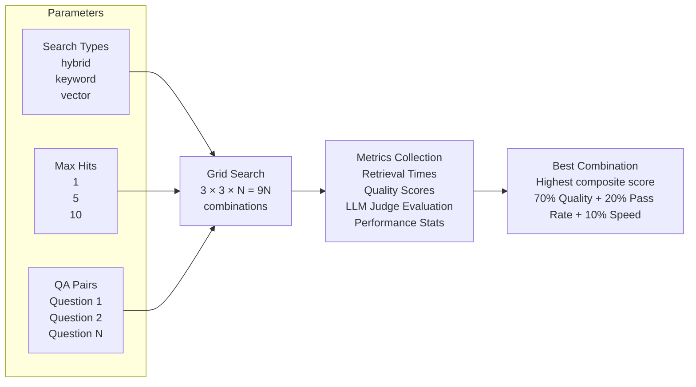

# Retrieval Performance Testing

This document describes the comprehensive test suite for evaluating the quality of the Policies Agent's document retrieval system using context-based similarity metrics and LLM judges.

## Overview

The retrieval performance test suite evaluates how well the Vespa-powered search system retrieves relevant policy documentation. It uses real QA pairs from insurance policy documents and measures performance using both context similarity and LLM-based evaluation.

## Hyper-Parameter Grid Search



## Evaluation Metrics

### Context-Based Metrics

#### Recall/Hit Rate
- **Purpose**: Measures whether relevant context was found
- **Range**: 0.0 - 1.0 (binary: found or not found)
- **Good Performance**: > 0.8

#### Context Coverage
- **Purpose**: Measures completeness of the best matching chunk
- **Range**: 0.0 - 1.0 (similarity score)
- **Good Performance**: > 0.6

### Ranking Metrics

#### Precision@k
- **Purpose**: Precision of top-k results
- **Default**: k=5, relevance threshold=0.5
- **Good Performance**: > 0.6

#### Mean Reciprocal Rank (MRR)
- **Purpose**: Quality of ranking with emphasis on top results
- **Range**: 0.0 - 1.0
- **Good Performance**: > 0.7

#### nDCG (Normalized Discounted Cumulative Gain)
- **Purpose**: Overall ranking quality considering position
- **Default**: k=10
- **Good Performance**: > 0.7

### Position-Based Hit Rates
- **Hit Rate @ Top-1**: % of queries with best result first
- **Hit Rate @ Top-3**: % of queries with best result in top 3
- **Hit Rate @ Top-5**: % of queries with best result in top 5

### LLM Judge Metrics

#### Retrieval Quality Score
- **Scale**: 0.0 - 1.0
  - 0.9-1.0: Excellent
  - 0.7-0.8: Good
  - 0.5-0.6: Adequate
  - 0.3-0.4: Poor
  - 0.0-0.2: Inadequate
- **Pass Threshold**: ≥ 0.7

#### Completeness Score
- **Purpose**: Information completeness for answering
- **Range**: 0.0 - 1.0

#### Relevance Score
- **Purpose**: Relevance of chunks to question
- **Range**: 0.0 - 1.0

## Running Performance Tests

### Prerequisites

**Environment Requirements:**
- Ensure all required environment variables are set in `.env`
- Tests automatically start an embedded service on a random port (10000-11000)
- No need to manually start any services beforehand

```bash
# Ensure Vespa is running and documents are indexed (if testing with real data)
make docker-up
make start-policies-document-ingestion
```

### Run Tests with LLM Judge (Default)
```bash
# Requires OpenAI API key in .env
make test-policies-retrieval-performance
```

### Run Tests Without LLM Judge
```python
# Configure the test to skip LLM evaluation
config = RetrievalTestConfiguration(enable_llm_judge=False)
tester = RetrievalPerformanceTester(config=config)
```

## Test Flow

The test follows a simplified 4-stage pattern:

1. **Prerequisites Check**: Start embedded service and verify health
2. **Stage 1 - Collect Results**: Execute all retrieval queries for parameter combinations
3. **Stage 2 - Generate Metrics**: Calculate performance metrics from results
4. **Stage 3 - LLM Judge (Optional)**: Evaluate quality using LLM judge
5. **Stage 4 - Report to MLflow**: Log all results and metrics

## Configuration Options

### Search Types
- `hybrid`: Combines keyword and vector search
- `keyword`: Traditional keyword-based search
- `vector`: Semantic vector search

### Max Hits Values
- `1`: Retrieve only top result
- `5`: Retrieve top 5 results
- `10`: Retrieve top 10 results

### Worker Configuration
- `max_query_workers`: Parallel query execution (default: 5)
- `max_eval_workers`: Parallel LLM evaluation (default: 3)

### Test Data
Located in `agents/policies/tests/retrieval_performance/filtered_qa_pairs.json`:
```json
{
  "question": "What is covered under fire damage?",
  "answer": "Fire damage covers...",
  "context": "The policy covers damage from fire...",
  "source_document": "home.md"
}
```

## Viewing Results

Results are logged to MLflow under experiment `retrieval_performance_evaluation`:

1. **Access MLflow UI**: http://localhost:5001
2. **Navigate to**: Experiments → retrieval_performance_evaluation
3. **Key Metrics**:
   - `avg_recall_score`: Overall hit rate
   - `avg_context_coverage`: Content matching quality
   - `avg_mrr_score`: Ranking effectiveness
   - `hit_rate_top_1`: First-result accuracy

## Performance Benchmarks

### Good Performance
- Recall Score: > 80%
- Context Coverage: > 60%
- MRR Score: > 70%
- Hit Rate @ Top-1: > 50%

### Warning Signs
- Recall < 50%: Missing relevant content
- Context Coverage < 30%: Poor matching
- MRR < 30%: Results buried deep
- Hit Rate @ Top-1 < 20%: Poor ranking


## Related Documentation

- [Ingestion Pipeline](ingestion-pipeline.md) - How documents are processed
- [Agents Overview](agents-overview.md) - Policies Agent details
- MLflow Docs: https://mlflow.org