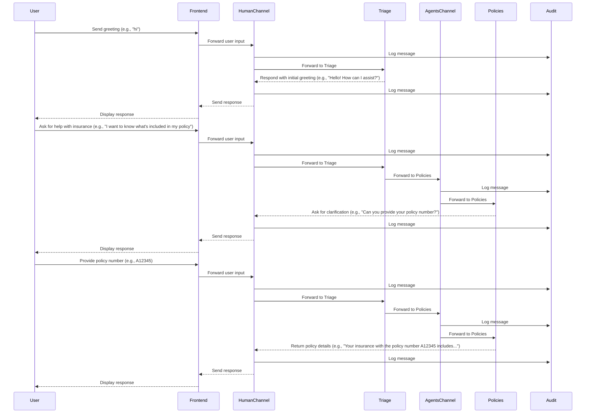

# System Architecture

## High-Level Architecture


## Component Responsibilities

### Message Flow Components

**Frontend Agent (WebSocket Gateway)**
- Manages WebSocket connections
- Handles reconnections and buffering
- Publishes to Human Channel

**Human Channel**
- Primary channel for user messages
- Subscribed by Triage and Audit agents
- Carries user requests and agent responses

**Agents Channel**
- Secondary channel for routed messages
- Subscribed by specialized agents
- Carries messages after triage routing

### Agent Components

**Triage Agent**
- Classifies user intent using ML models (v0-v5)
- Routes to appropriate specialized agent
- Handles small talk directly

**Specialized Agents**
- **Billing**: Payment info, premiums, due dates
- **Claims**: Claim status, filing, updates
- **Policies**: RAG-based document search
- **Escalation**: Complex issues, complaints

**Audit Agent**
- Monitors all channels
- Creates structured audit logs
- Provides compliance trail

### Infrastructure Services

**Redpanda (Kafka-compatible)**
- Message broker for all channels
- Ensures reliable message delivery
- Provides topic management

**Vespa**
- Vector search engine
- Stores policy documents
- Powers RAG for Policies agent

**Temporal**
- Workflow orchestration
- Manages document ingestion
- Provides durability and retries

## Message Routing Logic


## Data Flow Patterns

### 1. Synchronous Request-Response
```
User → Frontend → Human Channel → Triage → Agent → Response
```

### 2. Asynchronous Processing
```
Documents → Temporal Workflow → Vespa Index
User Query → Policies Agent → Vespa Search → Response
```

### 3. Audit Trail
```
All Messages → Audit Agent → Audit Logs Channel → Storage
```

## Scalability Considerations

- **Horizontal Scaling**: Each agent can run multiple instances
- **Channel Partitioning**: Redpanda supports partitioned topics
- **Stateless Agents**: No shared state between agent instances
- **Distributed Search**: Vespa cluster with 3 nodes

## Security Boundaries

- **WebSocket Gateway**: Input validation and rate limiting
- **Agent Isolation**: Each agent runs in separate process
- **Channel Security**: Message encryption in transit
- **Audit Compliance**: Complete message history

## Communication Flow Example

This sequence diagram shows a typical interaction where a user asks about their insurance policy:

