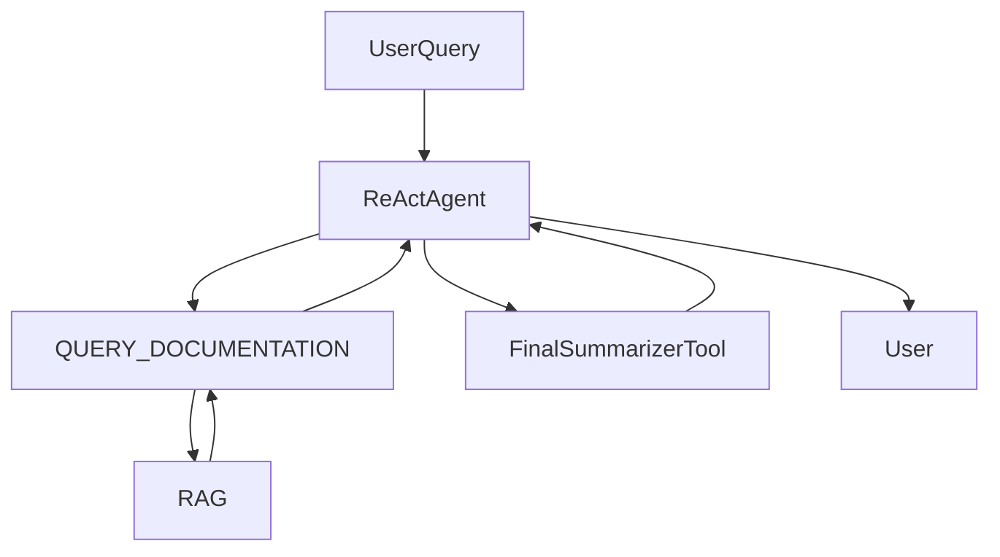

# 🧠 Agentic Decoupling of RAG Outputs in Insurance Chatbot

In our insurance chatbot, we use a **ReAct-based policy agent** built with [DSPy](https://github.com/stanfordnlp/dspy). One of the tools, `QUERY_DOCUMENTATION`, interfaces with a RAG system (built with [RAGATOUILLE](https://github.com/hwchase17/ragatouille)) to extract relevant policy data. However, we observed an issue:

> ⚠️ The ReAct agent tends to **regenerate** the answer from RAG output, leading to possible hallucinations, verbosity, or semantic drift.

This document explains:
- Why this happens
- Design patterns to decouple the responsibility
- A recommended solution
- Visual architecture (via Mermaid)

---

## 🤖 Problem: Redundant Regeneration

```mermaid
sequenceDiagram
    participant User
    participant ReAct Agent
    participant QUERY_DOCUMENTATION Tool
    participant RAG Engine

    User->>ReAct Agent: "What is covered in Clause 3?"
    ReAct Agent->>QUERY_DOCUMENTATION Tool: query("Clause 3")
    QUERY_DOCUMENTATION Tool->>RAG Engine: retrieve("Clause 3")
    RAG Engine-->>QUERY_DOCUMENTATION Tool: "Clause 3: Pre-existing conditions are not covered."
    QUERY_DOCUMENTATION Tool-->>ReAct Agent: result
    ReAct Agent->>LLM: "Generate final answer"
    LLM-->>ReAct Agent: "Clause 3 may exclude some conditions..."
````

* ❌ The final step causes potential hallucination.
* ❌ Agent rephrases content, potentially diluting legal precision.

---

## 🛠️ Design Patterns to Decouple Generation

### 1. **Structured Tool Return with Verbatim Flag**

Have the tool return structured data, clearly indicating whether the output should be used as-is:

```json
{
  "verbatim": true,
  "content": "Clause 3: Pre-existing conditions are not covered.",
  "source": "policy.pdf",
  "confidence": 0.91
}
```

Agent logic:

```python
if observation.get("verbatim"):
    return observation["content"]
```

✅ Pros:

* Enforces clarity
* Avoids unnecessary LLM involvement

❌ Cons:

* May limit composability across multiple tools

---

### 2. **Agent-as-Orchestrator**

Configure the policy agent to **only orchestrate**, not re-summarize:

* No direct answer generation from the agent
* All semantic responsibility lives in the tools

✅ Pros:

* Clean separation of concerns
  ❌ Cons:
* Harder to combine tool results if needed

---

### 3. **Final Summarizer Tool (Optional)**

Add an optional post-processing step **only if summarization is explicitly needed**:



✅ Pros:

* Keeps raw output intact
* Allows optional polish

❌ Cons:

* Additional latency and complexity

---

### 4. **DSPy Signature Binding**

Use DSPy type hints to enforce usage policy:

```python
class QueryDocumentation(Signature):
    """Query documentation for a factual answer."""
    query: str
    output: str = field(type="verbatim_text")
```

✅ Pros:

* Enforces correct behavior via modeling hints
  ❌ Cons:
* Requires consistent model adherence

---

### 5. **Tool Output Encapsulation (Opaque IDs)**

Let tools return **object references** or **IDs**, and defer rendering to the frontend or memory store.

✅ Pros:

* Enables reuse and storage
* Tools stay stateless

❌ Cons:

* Requires infra for dereferencing/rendering

---

## ✅ Recommended Strategy

> Combine **Structured Returns** with a **Final Summarizer Tool**

### Why?

* Preserves legal and factual fidelity
* Enables polish when needed
* Aligns with DSPy’s compositional approach

---

## 🔁 Example DSPy Flow

```python
class QueryDocumentation(Signature):
    query: str
    output: str = field(type="verbatim_text")

class FinalSummarizer(Signature):
    raw: str
    summary: str

# Inside ReAct Agent
obs = QUERY_DOCUMENTATION(query="Clause 3")
if obs.get("verbatim"):
    return obs["content"]
else:
    return FinalSummarizer(raw=obs["content"])
```

---

## 📌 Conclusion

By **decoupling the generation responsibility**, we:

* Reduce hallucinations
* Improve trustworthiness in legal/insurance domains
* Modularize our system for future scalability

> ✨ Use your LLMs wisely — orchestrate, don’t micromanage.
