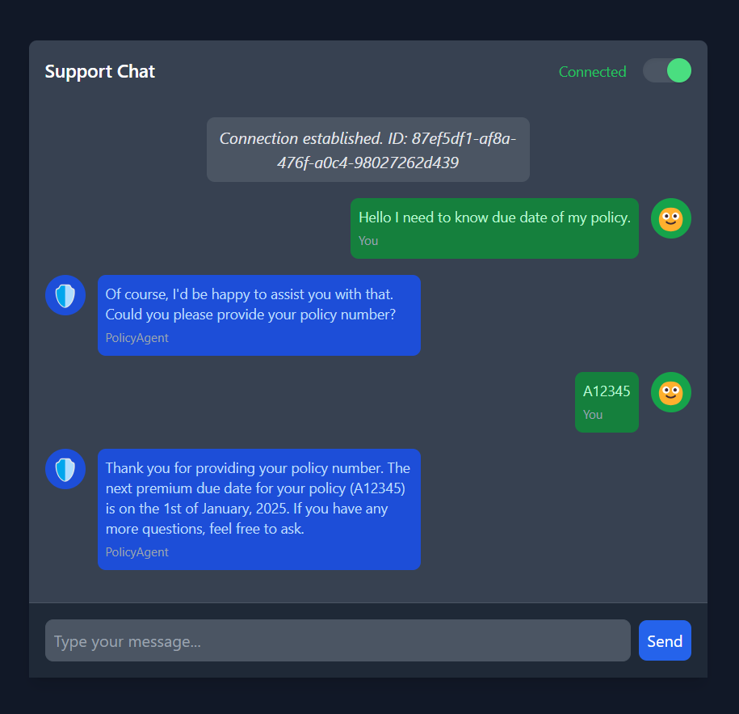

# Multi-Agent Insurance Support System Example for EggAI 🥚🤖

## **A Seamless Integration of Proven Components**

Building intelligent and collaborative systems often involves integrating well-established components to create a robust solution. The **Multi-Agent Insurance Support System** for **EggAI** exemplifies this approach by weaving together functionalities from previous EggAI examples to deliver an efficient and user-friendly insurance support platform.

### **Foundation from Previous Examples**

This example leverages key concepts and components from three foundational EggAI examples:

- **WebSocket Gateway (`examples/02-websocket-gateway`)**:
  - **Purpose**: Enables real-time, bidirectional communication between users and the server.
  - **Integration**: Serves as the backbone for the chat interface, allowing seamless message exchange through WebSockets.

- **LiteLlmAgent (`examples/05-litellm-agent`)**:
  - **Purpose**: Provides a lightweight interface for integrating language models, facilitating efficient agent interactions.
  - **Integration**: Powers the core agents (**TriageAgent**, **PolicyAgent**, and **TicketingAgent**) with language understanding and response generation capabilities.

- **Triage Concept (`examples/06-multi-agent-conversation`)**:
  - **Purpose**: Implements a central routing mechanism to direct user messages to the appropriate agent based on context.
  - **Integration**: Forms the intelligence behind the **TriageAgent**, ensuring accurate and context-aware message routing.

## **What’s Inside?** 🗂️

### **Agents Overview**

- **LiteLlmAgent**:
  - **Role**: Core agent class facilitating communication with language models.
  - **Features**: Supports tool integrations for enhanced functionality and task-specific operations.

- **PolicyAgent**:
  - **Role**: Handles inquiries related to insurance policies, including coverage details, premiums, and modifications.
  - **Functionality**: Accesses a mock `policies_database` to retrieve and provide accurate policy information.

- **TicketingAgent**:
  - **Role**: Manages support ticket creation and retrieval for issues requiring escalation.
  - **Functionality**: Utilizes a mock `ticket_database` to store and manage support tickets, informing users about escalation to human support.

- **TriageAgent**:
  - **Role**: Central router for user messages.
  - **Functionality**: Analyzes user inquiries and directs them to the appropriate agent (**PolicyAgent** or **TicketingAgent**) based on predefined guidelines and context.

### **System Components**

- **FastAPI Server with WebSocket Integration**:
  - **Function**: Hosts the real-time communication interface and serves the HTML chat interface (`chat.html`).
  - **Access**: Available at `http://127.0.0.1:8000/` with WebSocket support at `ws://127.0.0.1:8000/ws`.

- **User-Friendly Chat Interface**:
  - **Description**: A web-based UI that connects users to the WebSocket gateway, enabling real-time interaction with the multi-agent system.

## **How It Works** üåä

1. **User Interaction**:
   - Users access the chat interface via [http://127.0.0.1:8000/](http://127.0.0.1:8000/) and send messages related to their insurance needs.

2. **TriageAgent**:
   - Receives the user message, analyzes its content and context, and determines whether to route it to the **PolicyAgent** or **TicketingAgent**.

3. **PolicyAgent**:
   - If the inquiry is policy-related, the PolicyAgent retrieves information from the `policies_database` and responds accordingly.
   - If the request is outside its scope, it defers back to the TriageAgent for further handling.

4. **TicketingAgent**:
   - For issues requiring escalation, the TicketingAgent creates a support ticket in the `ticket_database` and notifies the user that their issue is being escalated to human support.

## **Prerequisites** üîß

Before running this example, ensure you have the following:

### **Step 1: Install Dependencies**

```bash
pip install eggai litellm fastapi uvicorn
```

### **Step 2: Start Services with Docker**

This example uses a messaging broker. Launch the necessary services using Docker:

```bash
docker compose up -d
```

## **Running the Example** 🏆

1. **Navigate to the Project Directory**:

   ```bash
   cd path/to/project-directory
   ```

2. **Run the Main Script**:

   ```bash
   python main.py
   ```

   - **Outcome**: Starts the FastAPI server accessible at `http://127.0.0.1:8000/` with WebSocket support at `ws://127.0.0.1:8000/ws`.

### **Access the Chat Interface**

Open your web browser and navigate to [http://127.0.0.1:8000/](http://127.0.0.1:8000/) to interact with the multi-agent system through the intuitive chat UI.

## **Expected Output** 📤

Upon running the example and accessing the chat interface, you should see a dynamic web-based chat UI similar to the screenshot below:



### **Sample Interaction**

1. **User** initiates the conversation:
    ```
    Hello, I need to check my policy details.
    ```

2. **TriageAgent** routes the message to **PolicyAgent**:
    ```
    📄 PolicyAgent:
    Hello! I'm here to help you with your policy inquiries. Could you please provide me with your **policy number**?
    If you don't have it handy, your **full name** will work too, and I can look up the details for you.
    ```

3. **User** provides the policy number:
    ```
    A12345
    ```

4. **PolicyAgent** responds with policy details:
    ```
    📄 PolicyAgent:
    Thank you for providing your policy number. Here are the details:

    - **Policy Number:** A12345
    - **Policyholder Name:** John Doe
    - **Coverage Details:** Comprehensive
    - **Premium Amount:** $500
    - **Due Date:** January 1, 2025

    If you have any more questions or need further assistance, feel free to ask!
    ```

5. **User** requests support for a billing issue:
    ```
    I need help with a billing issue.
    ```

6. **TriageAgent** routes the message to **TicketingAgent**:
    ```
    💬 TicketingAgent:
    We have created a support ticket ESC-0001 for your issue. Our Billing team will reach out to you shortly.
    ```

## **Architecture Overview** 🔁


1. **User Interaction**: Engages with the system through a WebSocket-enabled chat interface.
2. **TriageAgent**: Analyzes incoming messages and routes them to the appropriate agent based on content.
3. **PolicyAgent**: Handles policy-related inquiries using a mock `policies_database`.
4. **TicketingAgent**: Manages support ticket creation and retrieval for escalated issues.
5. **Channels**:
   - **User Channel**: Facilitates interactions between the user and the agents.
   - **Agents Channel**: Enables communication and coordination among different agents.
6. **WebSocket Gateway**: Oversees real-time communication between the FastAPI server and connected clients.

## **Code Breakdown** 🔬

### **Key Components**

1. **Agent Initialization**:
   - **TriageAgent**, **PolicyAgent**, and **TicketingAgent** are initialized using the **LiteLlmAgent** with specific system prompts and model configurations, defining their respective roles and functionalities.

2. **Mock Databases**:
   - **`policies_database`**: Simulates a repository of insurance policies for demonstration purposes.
   - **`ticket_database`**: Manages support tickets, facilitating the creation and retrieval processes.

3. **Tools Integration**:
   - **PolicyAgent Tools**:
     - **`get_policy_details`**: Retrieves specific policy information from the `policies_database`.
   - **TicketingAgent Tools**:
     - **`create_ticket`**: Generates new support tickets.
     - **`retrieve_ticket`**: Retrieves existing support tickets based on ticket IDs.

4. **Triage System Prompt**:
   - **Guidelines**: Provides the TriageAgent with criteria and keywords to assess and route user inquiries effectively.

5. **Message Handling**:
   - **WebSocket Communication**: Users interact through the chat interface, with messages processed by the TriageAgent and routed to the appropriate agents.
   - **Structured Communication**: Ensures context is maintained, providing clear and relevant responses.

6. **FastAPI Server**:
   - **Management**: Handles all WebSocket connections, routes messages through agent channels, and serves the chat interface (`chat.html`) to users.

7. **WebSocket Manager**:
   - **Functionality**: Manages connection states, routes messages between users and agents, and maintains message caches to preserve conversation context.

8. **Main Script (`main.py`)**:
   - **Initialization**: Sets up all agents, configures communication channels, and launches the FastAPI server with WebSocket support.
   - **Lifecycle Management**: Oversees the startup and shutdown processes, ensuring that all components operate smoothly and efficiently.

### **Reused Components from EggAI Examples**

- **WebSocket Gateway**:
  - **Source**: Adapted from `examples/02-websocket-gateway`.
  - **Function**: Facilitates real-time, bidirectional communication between the FastAPI server and connected clients.

- **LiteLlmAgent**:
  - **Source**: Derived from `examples/05-litellm-agent`.
  - **Function**: Provides a lightweight interface for integrating language models, enabling efficient processing and response generation.

- **Triage Concept**:
  - **Source**: Inspired by `examples/06-multi-agent-conversation`.
  - **Function**: Implements the **TriageAgent**, which intelligently routes user messages to the appropriate agents based on content analysis and predefined guidelines.

## **Cleaning Up** ‚ùå

When you've finished interacting with the system, gracefully shut down the services to free up resources:

```bash
docker compose down -v
```

- **Effect**: Stops and removes the Docker containers along with their associated volumes, ensuring no residual processes remain active.

## **Next Steps** üöÄ

Expand and enhance your multi-agent system with these next steps:

- **Explore**: Add new agents or enhance existing ones with additional tools and capabilities to handle a broader range of inquiries.
- **Integrate**: Connect the system to real databases or external services for dynamic data retrieval and storage, moving beyond mock databases.
- **Enhance UI**: Upgrade the `chat.html` interface to provide an even more engaging user experience, incorporating features like user authentication, message history, and real-time notifications.
- **Learn More**: Dive into other examples within the `examples` folder to discover advanced multi-agent patterns, integrations, and best practices.
- **Contribute**: Join the EggAI community by sharing your feedback, reporting issues, or contributing code to help improve the framework.

---

Thank you for exploring the **Multi-Agent Insurance Support System** example for EggAI! 🥚🤖 We hope this guide provides you with valuable insights into building and managing collaborative multi-agent systems to handle complex user interactions effectively. 🙏✨