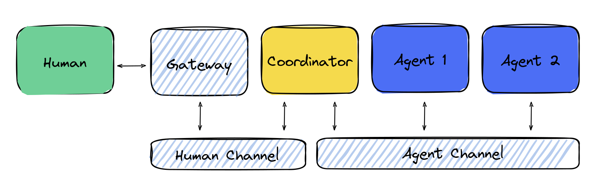

# Advanced Use Case: Multi-Agent Communication with Human, WebSocket, and Agent Channels

Welcome to the advanced example of the EggAI Multi-Agent Meta Framework! This demo showcases a rich workflow involving multiple communication channels, advanced coordination, and real-time message exchange.

The code for this example can be found [here](https://github.com/eggai-tech/EggAI/tree/main/examples/websocket_gateway).

## Key Communication Channels

1. **WebSocket Gateway Channel**: A specialized gateway that facilitates two-way communication between the human interface and the agent ecosystem through a WebSocket connection. Messages can flow from the human channel into the WebSocket and from the WebSocket back to the human channel.  
2. **Human Channel**: An interface for users (or frontends) to send and receive information related to complex workflows managed by agents.  
3. **Agent Channel**: Handles message passing and event-driven communications among multiple specialized agents.

## Agents Involved

- **WebsocketGateway Agent**: Acts as a bridge. It takes messages originating from the human interface (for example, a web UI) and translates them into messages for the agent ecosystem via the WebSocket connection. It also relays agent-generated messages back to the human interface.  
- **Coordinator Agent**: Orchestrates the end-to-end workflow. It routes incoming messages from the Human and WebSocket channels to the appropriate worker agents and ensures relevant responses or events are pushed back out to the human interface or WebSocket connection.  
- **Order Agent**: Manages order lifecycle events, from request to creation and confirmation.  
- **Email Agent**: Responsible for handling email-related tasks, such as sending notifications and confirmations.

## What Makes This Setup Special?

- **Real-Time Communication**: By introducing the WebsocketGateway Agent, your application can support live, bidirectional communication between users and the agent framework.  
- **Scalable Coordination**: The Coordinator Agent dynamically routes tasks and events, enabling seamless interaction between humans, web-based frontends, and backend agents.  
- **Event-Driven Workflow**: Agents respond to specific events (for example, `order_requested`, `order_created`) rather than following a rigid request-response pattern, allowing more flexible and extensible behavior.  
- **Separation of Concerns**: Each agent has a well-defined role, making it easier to extend or customize the workflow without entangling unrelated components.

Below is a conceptual architecture diagram for this example:



## Prerequisites

Ensure you have the following tools installed:

- **Python** 3.10+  
- **Docker** and **Docker Compose**

## Setup Instructions

Clone the EggAI repository:

```bash
git clone git@github.com:eggai-tech/EggAI.git
```

Move into the `examples/websocket_gateway` folder:

```bash
cd EggAI/examples/websocket_gateway
```

Create and activate a virtual environment (optional but recommended):

```bash
python -m venv venv
source venv/bin/activate  # For Windows: venv\Scripts\activate
```

Install the required dependencies:

```bash
pip install eggai fastapi uvicorn websockets
```

Start the broker and other infrastructure services using Docker Compose:

```bash
docker compose up -d
```

## Run the Example

```bash
python main.py
```

### What Happens Under the Hood?

1. A request to create an order (for example, a `Laptop` with quantity `1`) is sent through the Human Channel or via the WebsocketGateway Agent.  
2. The Coordinator Agent intercepts this request and broadcasts it into the Agent Channel.  
3. The Order Agent receives the `order_requested` event, processes the order, and emits an `order_created` event.  
4. The Email Agent picks up the `order_created` event and sends a notification email. It also emits a `notification` event back to the Coordinator.  
5. If using the WebSocket, the WebsocketGateway Agent streams any `notification` events back to the frontend in real-time and relays new requests arriving via the WebSocket back into the Agent Channel.  
6. The Coordinator sends a message confirming the order was created and that an email notification was sent.

Expected output might look like this:

```
Connection id: {"connection_id":"15b3a00b-41c0-467c-b411-8557dff2fab7"}
Message id: b6ad3608-2ce2-4c53-a123-45e9eec797cf
[ORDER AGENT]: order_requested event received. Emitting order_created event.
[EMAIL AGENT]: order_created event received. Sending email to customer.
[EMAIL AGENT]: order_created event received. Sending notification event.
[ORDER AGENT]: order_created event received.
Reply: {"id":"b6ad3608-2ce2-4c53-a123-45e9eec797cf","type":"notification","payload":{"message":"Order created, you will receive an email soon."}}
Agent is running. Press Ctrl+C to stop.
[WEBSOCKET GATEWAY]: WebSocket connection 15b3a00b-41c0-467c-b411-8557dff2fab7 closed.
```

## Clean Up

When you are finished experimenting, stop and clean up the Docker containers:

```bash
docker compose down -v
```

## Next Steps

- **Explore More Examples**: Check out the `examples/` folder for additional scenarios.  
- **Get Involved**: Contribute to EggAI by following our contribution guidelines.  
- **Open Issues or Suggest Features**: [File an issue on GitHub](https://github.com/eggai-tech/eggai/issues) if you encounter bugs or want to request new functionalities.  
- **Dive into the Documentation**: Refer to the official docs for in-depth configuration options and architectural best practices.

Thank you for using the EggAI Multi-Agent Meta Framework! Enjoy building responsive, scalable, and intelligent agent-driven systems.